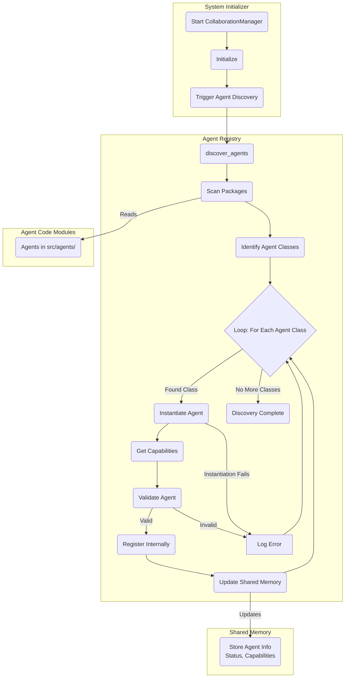
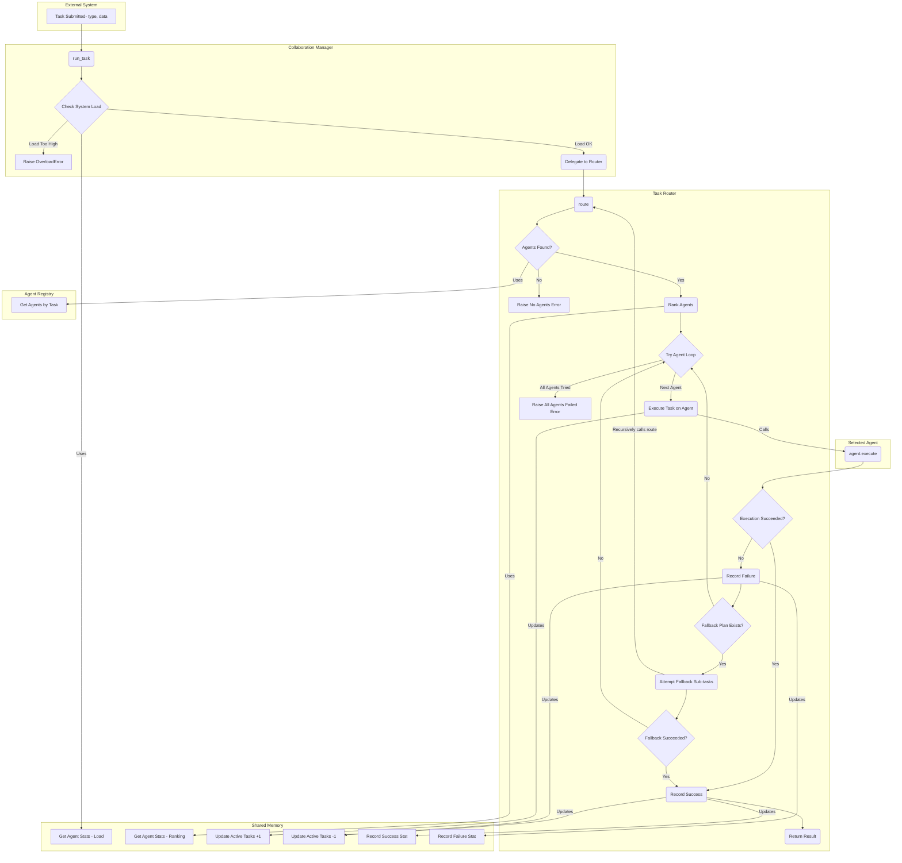
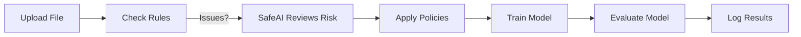
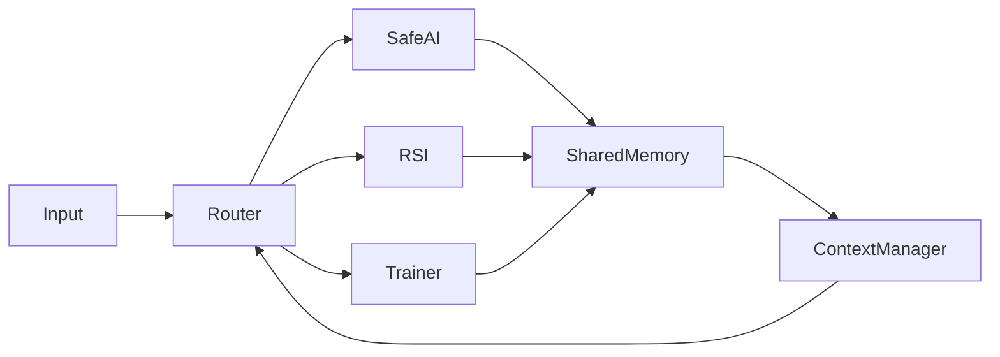

# Collaborative Module - SLAI

The `collaborative/` folder in SLAI helps different smart components ("agents") work together. They share data, perform tasks, and keep track of what's happening. This makes SLAI a powerful and well-organized system.

---

## What's in this folder?

1.  **`shared_memory.py`**:
    * Implements a thread-safe, in-memory storage mechanism (`SharedMemory` class) tailored for data sharing and coordination among agents within the same process.
    * Provides features like versioned storage, time-to-live (TTL) expiration for data, access tracking, priority queuing for tasks/data, and basic locking for conflict resolution.
    * **Note:** This is designed for single-process, multi-threaded environments and is not suitable for inter-process communication (IPC).

2.  **`registry.py`**:
    * Defines the `AgentRegistry` class, acting as a central directory for all active agents within the SLAI framework.
    * Handles dynamic discovery, registration, and unregistration of agents.
    * Tracks agent capabilities (the types of tasks they can perform) and their status (e.g., 'active', 'busy'), storing this information in the `SharedMemory` for system-wide visibility.
    * Allows querying for agents based on the tasks they support.

3.  **`task_router.py`**:
    * Contains the `TaskRouter` class, responsible for intelligently assigning incoming tasks to the most appropriate agent.
    * Selects agents based on their registered capabilities (from `AgentRegistry`) and performance metrics (like success rate and current load, tracked via `SharedMemory`).
    * Implements logic for handling agent failures and attempting fallback strategies or sub-tasks if an agent fails.
    * Records task success and failure statistics for each agent in `SharedMemory`.

4.  **`collaboration_manager.py`**:
    * Provides the `CollaborationManager` class, the central orchestrator for the collaborative components.
    * Initializes and integrates the `AgentRegistry` and `TaskRouter`.
    * Exposes methods to register agents and run tasks (which are then routed by the `TaskRouter`).
    * Monitors overall system load and agent health/availability.
    * Provides access to agent performance statistics stored in `SharedMemory`.

5.  **`__init__.py`**:
    * Makes key components like `SharedMemory` easily importable from the `src.collaborative` package.

## How it Works

1.  **Initialization**: The `CollaborationManager` starts, initializing the `AgentRegistry` and `TaskRouter`, both linked to a shared `SharedMemory` instance. The registry can dynamically discover agents.
2.  **Agent Registration**: Agents (defined in agent_factory) are registered with the `CollaborationManager`/`AgentRegistry`, specifying their capabilities. Their details and status are stored in `SharedMemory`.
3.  **Task Arrival**: A new task, defined by its type and data, is submitted to the `CollaborationManager`.
4.  **Routing**: The `CollaborationManager` delegates routing to the `TaskRouter`. The `TaskRouter` queries the `AgentRegistry` for agents capable of handling the task type.
5.  **Agent Selection**: The `TaskRouter` ranks eligible agents based on factors like historical success rate, priority, and current load (data retrieved from `SharedMemory`).
6.  **Execution Attempt**: The task is dispatched to the highest-ranked available agent. Agent load (`active_tasks`) is updated in `SharedMemory`.
7.  **Outcome**:
    * **Success**: The result is returned, and the agent's success stats are updated in `SharedMemory`. Active task count is decremented.
    * **Failure**: The failure is logged, stats are updated, and the `TaskRouter` may attempt a fallback plan or try the next-best agent. Active task count is decremented.
8.  **Coordination**: Throughout the process, agents can potentially read from or write to `SharedMemory` (using its `get`/`put` methods) to coordinate or share intermediate results, although the primary coordination mechanism shown here is via the router and registry.

This module enables the SLAI framework to distribute workloads effectively across specialized agents, manage shared state, and handle tasks collaboratively and robustly.

---

## Real-World Use Cases

This module can be used in real-life situations like:

### 1. **Checking Healthcare Data**
- All parts share patient data.
- SafeAI checks for risks like privacy issues.
- Only safe data is sent to the model trainer.

### 2. **Financial Risk Monitoring**
- RSI_Agent analyzes stock data.
- Results are stored in shared memory.
- The system moves forward only if it’s safe.

### 3. **Self-Driving Systems**
- Vision, navigation, and motor control work together.
- The router decides what happens and when.
- Keeps things safe, even if something breaks.

---

## Example: Data Check Pipeline

This flow makes sure:
- Data is checked.
- Risks are measured.
- Only approved data is used for training.

---

## Diagram: Agent Collaboration

---

## Stats (based on 50 test runs)

| Agent            | Avg Time (s) | Failures | Data Accesses |
|------------------|--------------|----------|----------------|
| SafeAI_Agent     | 1.7          | 0        | 50             |
| ModelTrainer     | 3.4          | 2        | 48             |
| RSI_Agent        | 4.1          | 1        | 30             |
| ContextManager   | 0.5          | 0        | 85             |

---

## What Can Be Improved?

- Use networked memory (e.g., Redis).
- Smarter router with GraphQL.
- Self-correcting agents that learn from errors.

---

For full documentation and code: [View SLAI on GitHub](https://github.com/The-Outsider-97/SLAI/tree/main)
