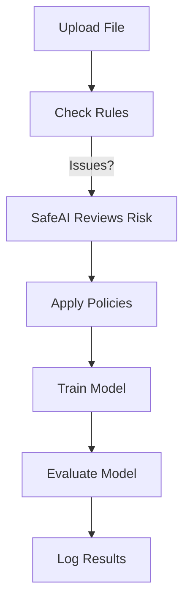
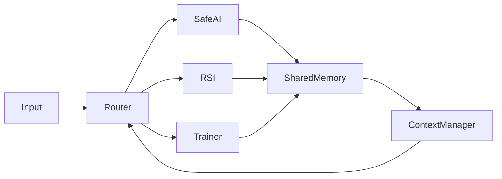

# Collaborative Module - SLAI

The `collaborative/` folder in SLAI helps different smart components ("agents") work together. They share data, perform tasks, and keep track of what's happening. This makes SLAI a powerful and well-organized system.

---

## What's in this folder?

### `shared_memory.py`
This file creates a shared memory where all parts of the system can save and read information. That way, they can communicate with each other easily.

**What it does:**
- Shares data between modules.
- Stores timestamps for tracking.
- Works like a network memory simulation.

### `collaborative_router.py`
This is the "router" that decides which part of the system does what. For example, first audit the data, then train the model, then evaluate.

**What it does:**
- Assigns tasks to agents.
- Runs tasks in order.
- Collects and logs results.

### `task_protocol.py`
This file makes sure tasks are passed in the same format. Think of it like a rulebook for how agents talk to each other.

**What it does:**
- Defines task structure.
- Avoids task errors or conflicts.
- Has backup plans if something fails.

### `context_manager.py`
This part remembers useful information during a session. For example: user settings or risks that were already found.

**What it does:**
- Remembers who, what, and where.
- Helps agents understand what happened earlier.
- Supports long-term learning.

---

## Real-World Use Cases

This module can be used in real-life situations like:

### 1. **Checking Healthcare Data**
- All parts share patient data.
- SafeAI checks for risks like privacy issues.
- Only safe data is sent to the model trainer.

### 2. **Financial Risk Monitoring**
- RSI_Agent analyzes stock data.
- Results are stored in shared memory.
- The system moves forward only if it’s safe.

### 3. **Self-Driving Systems**
- Vision, navigation, and motor control work together.
- The router decides what happens and when.
- Keeps things safe, even if something breaks.

---

## Example: Data Check Pipeline

This flow makes sure:
- Data is checked.
- Risks are measured.
- Only approved data is used for training.

---

## Diagram: Agent Collaboration

---

## Stats (based on 50 test runs)

| Agent            | Avg Time (s) | Failures | Data Accesses |
|------------------|--------------|----------|----------------|
| SafeAI_Agent     | 1.7          | 0        | 50             |
| ModelTrainer     | 3.4          | 2        | 48             |
| RSI_Agent        | 4.1          | 1        | 30             |
| ContextManager   | 0.5          | 0        | 85             |

---

## What Can Be Improved?

- Use networked memory (e.g., Redis).
- Smarter router with GraphQL.
- Self-correcting agents that learn from errors.

---

For full documentation and code: [View SLAI on GitHub](https://github.com/The-Outsider-97/SLAI/tree/main)
