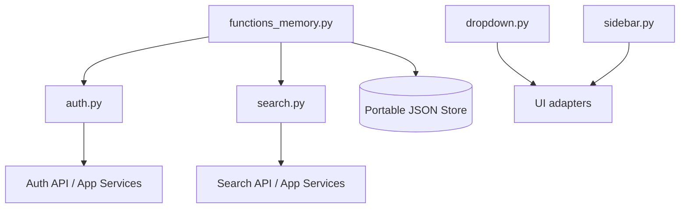
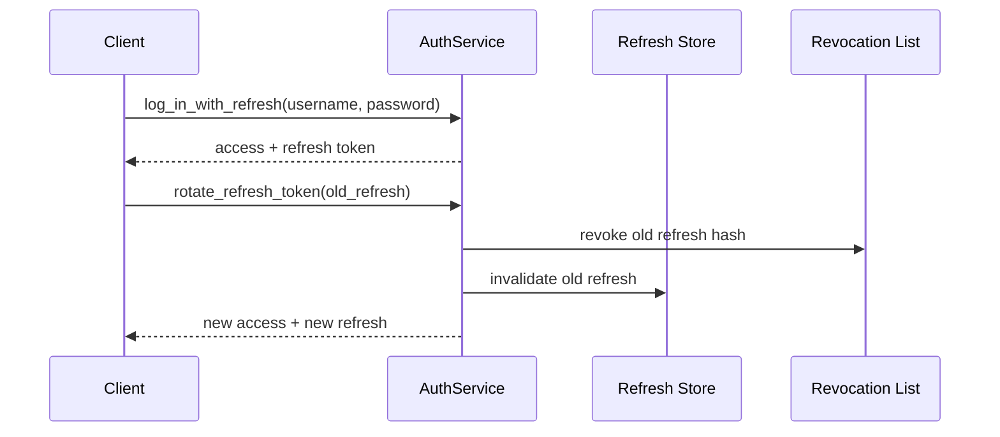
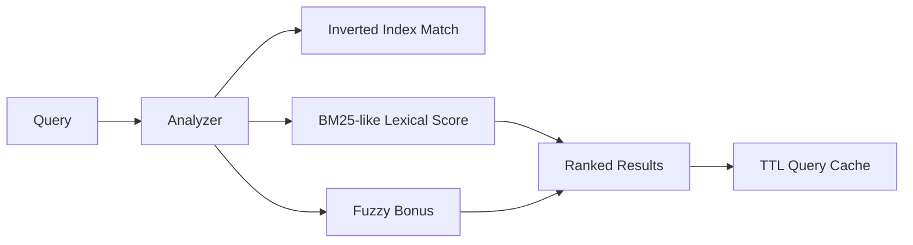
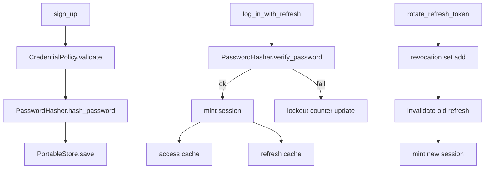

# `src/functions` — Reusable Application Function Layer

The `src/functions` package provides portable, framework-agnostic building blocks for common app capabilities:

1. **Stronger authentication** (with refresh-token rotation and revocation)
2. **Smarter search** (with pluggable analyzers)
3. **Interactive dropdown state** (with easing presets/interpolation strategies)
4. **Hideable/collapsible sidebar state** (with richer animation helpers)

---

## Architecture Overview







---

## Module Guide

## 1) `functions_memory.py`

Core primitives shared by auth/search:

- `CredentialPolicy`: password complexity gates.
- `PasswordHasher`: `scrypt` hashing + constant-time verification.
- `TTLCache`: thread-safe TTL+LRU cache.
- `PortableStore`: atomic JSON persistence for portability.

---

## 2) `auth.py`

### Main types
- `AuthToken`: short-lived access token.
- `RefreshToken`: long-lived refresh token.
- `AuthSession`: access+refresh pair.
- `UserRecord`: user credential/lockout metadata.

### Key capabilities

- Sign-up with policy checks (`CredentialPolicy`).
- Login hardening:
  - failed-attempt counters,
  - temporary lockout windows.
- Access token validation.
- **Refresh token rotation** via `rotate_refresh_token(...)`:
  - invalidates old refresh token,
  - adds old token hash to revocation list,
  - mints new access+refresh pair.
- **Revocation list** support via hashed token keys:
  - `revoke_token(...)`
  - `get_revocation_list(...)`
  - revoked tokens fail validation checks.

### Auth flow details



---

## 3) `search.py`

### Pluggable analyzers

- `SearchAnalyzer` (Protocol): analyzer interface.
- `BasicAnalyzer`: normalization/tokenization baseline.
- `StemAnalyzer`: lightweight suffix stemming.
- `LanguageAwareAnalyzer(language="en"|"es"|"nl")`: stopword-aware tokenization.

### Ranking strategy

1. Build per-query in-memory index.
2. BM25-like lexical scoring.
3. Fuzzy similarity bonus for misspellings.
4. Return ranked `SearchResult` entries.
5. Cache results with analyzer-aware cache keys.

---

## 4) `dropdown.py`

### Animation upgrades

- Easing presets (`EASING_PRESETS`): `smooth`, `snappy`, `gentle`, `spring`.
- Interpolation strategies (`INTERPOLATION_STRATEGIES`):
  - `linear`
  - `ease_in`
  - `ease_out`
  - `ease_in_out`

### UI helper APIs

- `transition_style()` → CSS transition string.
- `animation_frames(steps, strategy=...)` → deterministic keyframe values.

---

## 5) `sidebar.py`

`Sidebar` reuses the shared animation model:

- supports `SidebarAnimation(preset=...)`
- supports `visibility_keyframes(steps, strategy=...)`
- supports hide/show + per-section expand/collapse

This keeps animation behavior consistent across dropdown/sidebar components.

---

## Import Examples

```python
from src.functions import (
    # Auth
    AuthService,
    AuthSession,

    # Search
    SearchEngine,
    BasicAnalyzer,
    StemAnalyzer,
    LanguageAwareAnalyzer,

    # UI
    DropdownMenu,
    DropdownOption,
    Sidebar,
)
```

---

## End-to-End Example

```python
from src.functions import (
    AuthService,
    SearchEngine,
    LanguageAwareAnalyzer,
    DropdownMenu,
    DropdownOption,
    Sidebar,
)

# 1) Strong auth + refresh rotation
service = AuthService()
service.sign_up("alex", "MyStrongP@ssw0rd!")
session = service.log_in_with_refresh("alex", "MyStrongP@ssw0rd!")
rotated = service.rotate_refresh_token(session.refresh.token)
assert service.is_token_valid(rotated.access.token)

# 2) Search with pluggable analyzer
items = [
    {"title": "Running Shoes", "description": "Shoes for runners"},
    {"title": "Trail Shoe", "description": "Outdoor running comfort"},
]
engine = SearchEngine(fields=["title", "description"], analyzer=LanguageAwareAnalyzer("en"))
results = engine.search(items, "runnng shoe")

# 3) Dropdown animation strategies
drop = DropdownMenu(options=[DropdownOption("A", "a"), DropdownOption("B", "b")])
frames = drop.animation_frames(steps=12, strategy="ease_in_out")

# 4) Sidebar interpolation
sidebar = Sidebar(sections=["Dashboard", "Search", "Settings"])
sidebar_frames = sidebar.visibility_keyframes(steps=12, strategy="ease_out")
```

---

## Production Notes

- `PortableStore` is ideal for local/dev. For high-scale production, replace with DB-backed repositories.
- In multi-instance deployments, token/query cache should move to shared cache infrastructure.
- Analyzer system is designed to be extended with domain-specific NLP analyzers.
