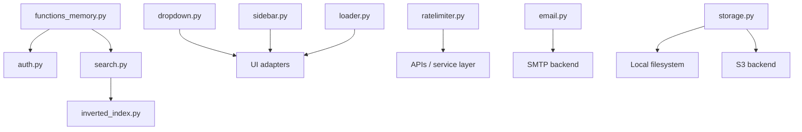
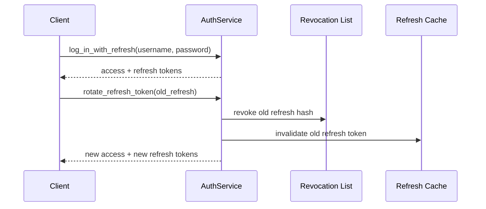
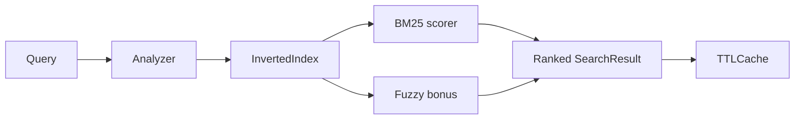

# `src/functions` — Reusable Application Function Layer

`src/functions` provides portable, framework-agnostic building blocks for common application capabilities:

1. Authentication with lockout, refresh-token rotation, and revocation
2. Search with pluggable analyzers, BM25-style ranking, fuzzy matching, and caching
3. UI state helpers for dropdowns, sidebars, and loading overlays
4. Rate limiting with in-memory and Redis-backed token buckets
5. Email delivery with SMTP, async queueing, and simple templating
6. File storage with local filesystem and S3 backends
7. Transport adapters for LoRa/serial/mesh/LTE/SATCOM connect-send-receive workflows

---

## Package Exports

```python
from src.functions import (
    # Auth
    AuthService,
    AuthSession,
    AuthToken,
    RefreshToken,
    UserRecord,

    # Search
    SearchEngine,
    SearchResult,
    BasicAnalyzer,
    StemAnalyzer,
    StopwordAnalyzer,
    InvertedIndex,
    BM25Scorer,
    SearchAnalyzer,

    # UI helpers
    DropdownMenu,
    DropdownOption,
    AnimationConfig,
    EASING_PRESETS,
    INTERPOLATION_STRATEGIES,
    Sidebar,
    SidebarAnimation,
    SidebarSection,
    Loader,
    LoaderContext,

    # Shared primitives
    CredentialPolicy,
    PasswordHasher,
    PortableStore,
    TTLCache,

    # Service helpers
    RateLimiter,
    EmailService,
    SMTPBackend,
    Storage,
    LocalStorage,
    S3Storage,

    # Transport
    TransportService,
    TransportPacket,
    TransportType,
    ChannelState,
    ChannelStatus,
    LoRaAdapter,
    SerialAdapter,
    MeshAdapter,
    LTEAdapter,
    SATCOMAdapter,
)
```

---

## Architecture Overview







---

## Module Guide

## 1) `functions_memory.py`

Shared memory and security primitives used by other modules.

### Main components

- `CredentialPolicy`: configurable password-complexity validation
- `PasswordHasher`: `scrypt` hashing with constant-time verification
- `TTLCache`: thread-safe TTL + LRU cache
- `PortableStore`: atomic JSON persistence with file locking

### Typical uses

- enforce password requirements before signup
- cache short-lived search or token metadata
- persist lightweight local state without introducing a database

---

## 2) `auth.py`

Authentication service with lockout protection, access tokens, refresh-token rotation, and token revocation.

### Main types

- `AuthToken`: short-lived access token
- `RefreshToken`: long-lived refresh token
- `AuthSession`: access + refresh token pair
- `UserRecord`: stored user credential and lockout metadata

### Key capabilities

- password policy validation through `CredentialPolicy`
- password hashing through `PasswordHasher`
- configurable failed-attempt tracking and temporary account lockout
- access-token validation via `is_token_valid(...)`
- refresh-token validation via `is_refresh_token_valid(...)`
- refresh-token rotation via `rotate_refresh_token(...)`
- token revocation via `revoke_token(...)` and `log_out(...)`
- local persistence of users and revoked token hashes through `PortableStore`

### Example

```python
from src.functions import AuthService

service = AuthService()

user_id = service.sign_up("alex", "MyStrongP@ssw0rd!")
session = service.log_in_with_refresh("alex", "MyStrongP@ssw0rd!")

assert service.is_token_valid(session.access.token)
assert service.is_refresh_token_valid(session.refresh.token)

rotated = service.rotate_refresh_token(session.refresh.token)
assert service.is_token_valid(rotated.access.token)
```

---

## 3) `search.py`

Search utilities built on a persistent in-memory inverted index, BM25-style scoring, fuzzy matching, and TTL caching.

### Available analyzers

- `BasicAnalyzer`: lowercases and tokenizes on non-alphanumeric characters
- `StemAnalyzer`: applies light suffix stripping
- `StopwordAnalyzer(language="en" | "es" | "nl")`: removes stopwords from a JSON file or built-in fallback sets
- `SearchAnalyzer`: protocol exported from `utils.inverted_index`

### Ranking model

1. tokenize the query with the configured analyzer
2. fetch candidate documents from the inverted index
3. compute BM25-style lexical scores
4. add fuzzy-match bonus for approximate token matches
5. return ranked `SearchResult` objects
6. cache results with `TTLCache`

### Important usage note

`SearchEngine.search(...)` searches the engine's current index. Index documents first with `index_documents(...)` or incrementally with `add_document(...)`.

### Example

```python
from src.functions import SearchEngine, StopwordAnalyzer

items = [
    {"title": "Running Shoes", "description": "Shoes for runners"},
    {"title": "Trail Shoe", "description": "Outdoor running comfort"},
]

engine = SearchEngine(
    fields=["title", "description"],
    analyzer=StopwordAnalyzer(language="en"),
)
engine.index_documents(items)

results = engine.search("runnng shoe")
for result in results:
    print(result.score, result.item)
```

---

## 4) `dropdown.py`

Reusable dropdown state model with animation presets and interpolation helpers.

### Main types

- `DropdownOption`
- `AnimationConfig`
- `DropdownMenu`

### Highlights

- easing presets exposed through `EASING_PRESETS`
- interpolation helpers exposed through `INTERPOLATION_STRATEGIES`
- `toggle()` for open/close state
- `animation_frames(steps, strategy=...)` for deterministic animation values
- `transition_style()` returns an empty string because Qt/QSS transitions are expected to be handled in the UI layer

### Example

```python
from src.functions import DropdownMenu, DropdownOption

menu = DropdownMenu(
    options=[
        DropdownOption("Dashboard", "dashboard"),
        DropdownOption("Settings", "settings"),
    ],
    default_value="dashboard",
)

menu.toggle()
frames = menu.animation_frames(steps=8, strategy="ease_in_out")
```

---

## 5) `sidebar.py`

Sidebar state helpers that reuse the same easing and interpolation model as the dropdown helpers.

### Main types

- `SidebarSection`
- `SidebarAnimation`
- `Sidebar`

### Highlights

- hide/show/toggle sidebar visibility
- expand/collapse individual sections
- `visibility_keyframes(...)` for deterministic animation keyframes
- consistent easing presets shared with `dropdown.py`

### Example

```python
from src.functions import Sidebar

sidebar = Sidebar(sections=["Dashboard", "Search", "Settings"])
sidebar.toggle_visibility()
sidebar.toggle_section("Search")
frames = sidebar.visibility_keyframes(steps=10, strategy="ease_out")
```

---

## 6) `loader.py`

Thread-safe loader state manager with ETA estimation for long-running operations.

### Main types

- `LoaderState`
- `Loader`
- `LoaderContext`

### Highlights

- supports step-based progress (`total_steps=...`)
- supports continuous progress (`progress` values from `0.0` to `1.0`)
- computes estimated remaining time
- smooths ETA when `total_steps` is not known
- integrates with UI callbacks using `on_update` and `on_complete`

### Example

```python
import time
from src.functions import Loader, LoaderContext

loader = Loader(total_steps=5, on_update=lambda state: print(state.progress, state.message, state.eta))
loader.start("Loading data...")
for i in range(5):
    time.sleep(0.1)
    loader.update(steps_done=i + 1, message=f"Step {i + 1}/5")
loader.complete("Done!")

with LoaderContext(Loader(total_steps=3), "Processing") as managed_loader:
    for i in range(3):
        managed_loader.update(steps_done=i + 1, message=f"Chunk {i + 1}/3")
```

---

## 7) `ratelimiter.py`

Token-bucket rate limiter with in-memory and Redis-backed stores.

### Main components

- `RateLimiter`
- `InMemoryStore`
- `RedisStore`
- internal `_TokenBucket` and `_RedisTokenBucket` implementations

### Highlights

- per-key rate limiting (`user`, `IP`, or any arbitrary string key)
- in-memory backend for single-process deployments
- Redis backend for distributed deployments
- convenience helpers: `allow(...)` and `check(...)`

### Example

```python
from src.functions import RateLimiter

limiter = RateLimiter.from_config(backend="memory")

if limiter.allow("user:123"):
    print("allowed")
else:
    print("blocked")

limiter.check("user:123")
```

---

## 8) `email.py`

Email abstraction with SMTP delivery, optional async queueing, and simple `string.Template`-based HTML templating.

### Main types

- `EmailBackend`
- `SMTPBackend`
- `EmailService`

### Highlights

- SMTP delivery with optional TLS
- plain-text + HTML multipart email support
- optional async worker thread for queued sends
- template rendering with `template_dir` and `context`
- `from_config(...)` helper for SMTP-backed setup

### Example

```python
from src.functions import EmailService

mailer = EmailService.from_config(async_send=False)
mailer.send(
    to="user@example.com",
    subject="Welcome",
    body_html="<h1>Hello</h1><p>Your account is ready.</p>",
    body_text="Hello\n\nYour account is ready.",
)
```

---

## 9) `storage.py`

Pluggable file-storage abstraction with local filesystem and S3 backends.

### Main types

- `StorageBackend` (abstract interface in `storage_backend.py`)
- `LocalStorage`
- `S3Storage`
- `Storage`

### Highlights

- local file uploads, downloads, deletes, and URL generation
- path traversal protection in `LocalStorage`
- optional S3 support via `boto3`
- `Storage.from_config()` helper for backend selection
- optional unique filename generation to avoid collisions

### Important usage note

Do **not** instantiate `StorageBackend` directly. It is abstract. Use `LocalStorage`, `S3Storage`, or `Storage.from_config()`.

### Example

```python
from io import BytesIO
from src.functions import Storage, LocalStorage

backend = LocalStorage(base_path="data/storage", base_url=None)
storage = Storage(backend=backend, generate_unique_filename=True)

saved_path = storage.upload(BytesIO(b"hello world"), filename="hello.txt", subpath="docs")
content = storage.download(saved_path.replace(str(backend.base_path) + "/", ""))
print(content)
```

For configuration-driven setup:

```python
from src.functions import Storage

storage = Storage.from_config()
```

---

## Quick Start

```python
from src.functions import (
    AuthService,
    SearchEngine,
    StopwordAnalyzer,
    DropdownMenu,
    DropdownOption,
    Sidebar,
    Loader,
    RateLimiter,
    Storage,
)

# Auth
service = AuthService()

# Search
engine = SearchEngine(fields=["title", "description"], analyzer=StopwordAnalyzer("en"))
engine.index_documents([
    {"title": "Running Shoes", "description": "Shoes for runners"},
    {"title": "Trail Shoe", "description": "Outdoor running comfort"},
])
results = engine.search("running shoe")

# UI state
menu = DropdownMenu([DropdownOption("A", "a"), DropdownOption("B", "b")])
sidebar = Sidebar(["Home", "Search", "Settings"])
loader = Loader(total_steps=10)

# Rate limiting
limiter = RateLimiter.from_config(backend="memory")

# Storage
storage = Storage.from_config()
```

---

## Optional Dependencies

Depending on which modules you use, you may need additional packages:

- `portalocker` for `PortableStore`
- `boto3` for `S3Storage`
- `redis` client library for Redis-backed rate limiting
- `PyYAML` for config loading

---

## Production Notes

- `PortableStore` is well suited to local development and lightweight deployments; use a database or managed persistence layer for larger systems.
- Move auth/query caches to shared infrastructure in multi-instance deployments.
- Use Redis-backed rate limiting for horizontally scaled services.
- Keep SMTP credentials and auth peppers outside source control.
- Prefer `Storage.from_config()` or a concrete backend instance over direct use of the abstract `StorageBackend` base class.


## 7) `transport.py`

Transport communication layer that normalizes channel operations across LoRa, serial, mesh, LTE, and SATCOM adapters.

### Main types

- `TransportService`: orchestrates multiple adapters by alias
- `TransportAdapter`: shared connect/send/receive/retry contract
- `TransportPacket`: payload envelope with source/destination metadata
- `ChannelState`: status + signal quality snapshots
- Adapter implementations: `LoRaAdapter`, `SerialAdapter`, `MeshAdapter`, `LTEAdapter`, `SATCOMAdapter`

### Key capabilities

- consistent `connect(...)`, `disconnect(...)`, `send(...)`, and `receive(...)` APIs
- bounded `send_with_retry(...)` with exponential backoff + jitter
- channel health status transitions (`DISCONNECTED`, `CONNECTING`, `READY`, `DEGRADED`, `ERROR`)
- injectable receive buffer for simulation and test scenarios

### Example

```python
from src.functions import TransportPacket, TransportService, LoRaAdapter

transport = TransportService({"field-lora": LoRaAdapter(name="field-lora")})
transport.connect("field-lora")

packet = TransportPacket(payload=b"hello", source="node-1", destination="gateway")
tx_id = transport.send_with_retry("field-lora", packet, max_attempts=4)
ack = transport.receive("field-lora", timeout_seconds=1.0)

print(tx_id, ack.metadata if ack else None)
```