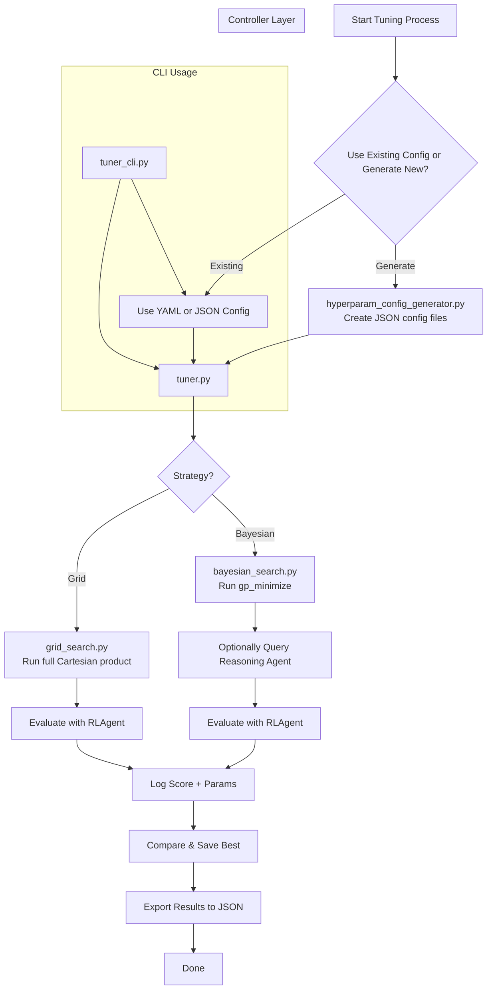
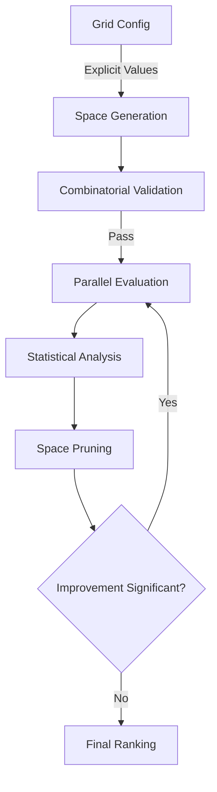

The files tuning/ module work together to create a modular and intelligent hyperparameter tuning system, with support for Bayesian Optimization, Grid Search, CLI integration, and future extension with Reasoning Agents. Here's a breakdown of how each file contributes:

# Individual File Roles
## 1. hyperparam_config_generator.py
Purpose: Auto-generates grid and bayesian config JSON files from a default hyperparameter schema.
Core Functions:

create_default_config(): Specifies a rich, generalizable hyperparameter schema.

generate_and_save(): Converts this schema into two formats:

grid_config.json (with discrete values)

bayesian_config.json (with continuous ranges, priors)

Academic Insight: Enables reproducible research by enforcing consistent, declarative config formats (cf. Feurer et al., AutoML, 2019).

## 2. grid_search.py
Purpose: Performs exhaustive hyperparameter search using Cartesian product of values (brute-force).
Core Functions:

_load_search_space(): Parses grid_config.json and builds the search space.

run_search(): Iteratively tests each combination, logs, and saves the best.

Why it matters: Grid search is mathematically guaranteed to find the global optimum only if the optimal hyperparameters lie within the grid (cf. Bergstra & Bengio, 2012).

## 3. bayesian_search.py
Purpose: Performs Bayesian Optimization using Gaussian Processes (gp_minimize).
Core Features:

Uses skopt.space to build search space.

Integrates with a reasoning agent for adaptive suggestions.

Tracks history, logs results, and serializes outputs.

Advanced Behavior:

Blends suggestions from a ReasoningAgent, which can nudge the optimizer intelligently based on past performance.

Why it matters: Bayesian search balances exploration/exploitation better than grid or random search. Adds intelligence via the reasoning agent—potentially linked to SLAI's reasoning_agent.

## 4. tuner.py
Purpose: Unified entry point that chooses and runs the correct strategy (grid or bayesian) using provided configs.
Core Role:

Acts as the controller class.

Supports dynamic selection, injection of evaluation_function, and parameter overrides.

Why it matters: This abstraction lets any SLAI agent or config plug into a standardized tuner.

## 5. tuner_cli.py
Purpose: Command-line interface to launch the tuner with arguments.
Key Capabilities:

Select strategy with --strategy.

Specify config via --config.

Uses a realistic RLAgent for training/evaluation.

What makes it powerful: Enables non-programmers or pipelines to trigger experiments with reproducible CLI commands—critical for MLops.

## 6. hyperparam.yaml
Purpose: Unified configuration file for experiments.
Sections:

Agent metadata (DQN, MAML, RSI)

Hyperparameter definitions

Tuning strategy and paths

Monitoring, rollback, compliance, logging

Why it’s essential: YAML is preferred in academic/industry ML for structured, readable, and easily overridden config control (cf. Ray Tune & Hydra).

## 7. bayesian_config.json and grid_config.json
Generated by: hyperparam_config_generator.py
Purpose: Precomputed tuning schemas for each search strategy:

grid_config.json: Fixed value lists

bayesian_config.json: Ranges + priors for smarter search

---
1. [Author or agent] writes tuning schema in YAML or uses generator.
2. `hyperparam_config_generator.py` creates configs.
3. `tuner.py` loads chosen strategy and config.

   ├── if grid → `GridSearch`
   └── if bayesian → `BayesianSearch`
5. Evaluation function (usually a `RLAgent`) trains + scores model.
6. Best params & results saved in `results/`, monitored via logs.
7. `tuner_cli.py` provides easy shell-level access to this entire pipeline.
---

