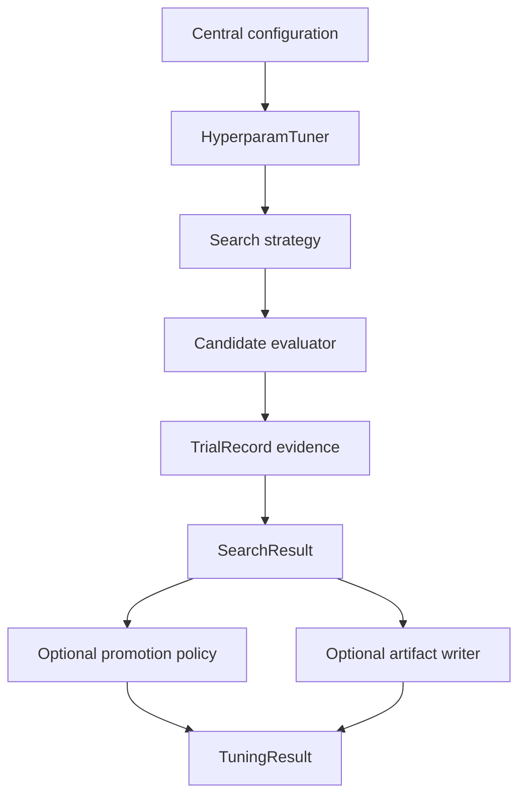
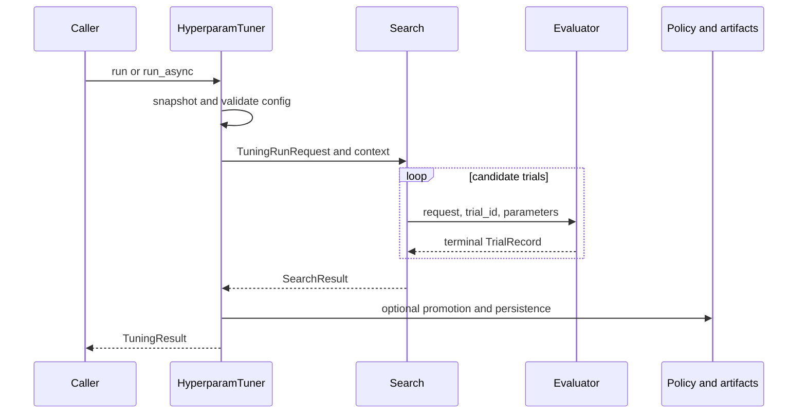
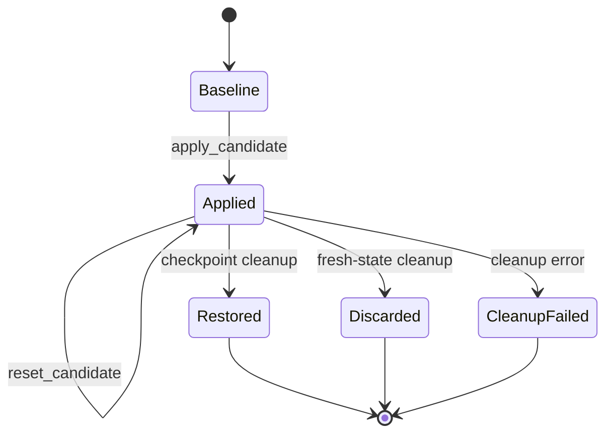

# SLAI tuning

`src/tuning` provides the strategy-independent tuning lifecycle for SLAI. It
coordinates immutable run configuration, candidate search, supervised or
agent-aware evaluation, result validation, optional promotion policy, and
transactional artifact persistence.

The package deliberately separates **candidate selection** from **candidate
evaluation**. Search strategies do not train models or mutate agents, while
evaluators do not choose the next candidate or promote it. This separation is
especially important when evaluation changes live state, as can occur with
adaptive agents, meta-learning systems, and quantum or hybrid models.

## Architecture


```mermaid
flowchart TD
    C["Central configuration"] --> T["HyperparamTuner"]
    T --> S["Search strategy"]
    S --> E["Candidate evaluator"]
    E --> TR["TrialRecord evidence"]
    TR --> SR["SearchResult"]
    SR --> P["Optional promotion policy"]
    SR --> A["Optional artifact writer"]
    P --> R["TuningResult"]
    A --> R
```

The arrows describe contract flow, not ownership of mutable state. An agent
transaction remains owned by the agent evaluator and must be cleaned up before
its `TrialRecord` can be eligible for promotion.

## Package layout

| Path | Responsibility |
| --- | --- |
| `tuner.py` | Builds immutable run requests, dispatches search, verifies returned contracts, invokes optional promotion and artifact callbacks, and composes `TuningResult`. |
| `tuning_types.py` | Canonical enums and immutable records exchanged by every tuning component. |
| `tuning_contracts.py` | Runtime-checkable adapter protocols for supervised models, data splits, agent transactions, scenarios, search, promotion, and artifacts. |
| `tuning_validation.py` | Cross-field validation for configuration, search spaces, candidates, trials, and best-trial correctness. |
| `tuning_artifacts.py` | Transactional, immutable, checksummed JSON artifact bundles. |
| [`search/`](search/README.md) | Grid and sequential Bayesian candidate selection. |
| [`evaluators/`](evaluators/README.md) | Leakage-resistant supervised evaluation and transactional agent evaluation. |
| [`networks/`](networks/README.md) | NumPy dense and variational Bayesian reference networks. |
| `utils/config_loader.py` | Tuning facade over SLAI's shared configuration repository. |
| `utils/tuning_errors.py` | Structured tuning error taxonomy and context propagation. |
| `utils/tuning_helpers.py` | Serialization, redaction, fingerprinting, identifier, import, and atomic-write helpers. |
| `configs/hyperparam.yaml` | Central tuning, evaluator, network, search-space, and artifact configuration. |

## Lifecycle

`HyperparamTuner` coordinates one configuration snapshot through the following
sequence:

1. Deep-copy the supplied configuration or load `configs/hyperparam.yaml`
   through the shared SLAI configuration repository.
2. Validate the centralized configuration, including agreement between
   `tuning.objective` and the objective of the active evaluator.
3. Resolve `TunerSettings`, the strategy section, model-specific search space,
   objective, seeds, scenario selection, and semantic configuration
   fingerprint.
4. Construct an immutable `TuningRunRequest`.
5. Dispatch the request to the registered or built-in strategy runner.
6. Require the strategy to return a structurally consistent `SearchResult`.
7. Invoke an explicit promotion policy, if supplied and a best trial exists.
8. Invoke an artifact writer, if supplied, and compose the final
   `TuningResult`.


```mermaid
sequenceDiagram
    participant U as Caller
    participant T as HyperparamTuner
    participant S as Search
    participant E as Evaluator
    participant X as Policy and artifacts

    U->>T: run or run_async
    T->>T: snapshot and validate config
    T->>S: TuningRunRequest and context
    loop candidate trials
        S->>E: request, trial_id, parameters
        E-->>S: terminal TrialRecord
    end
    S-->>T: SearchResult
    T->>X: optional promotion and persistence
    T-->>U: TuningResult
```

### Synchronous and asynchronous execution

- `HyperparamTuner.run()` is the synchronous boundary. It rejects awaitables
  returned by a search runner, promotion policy, or artifact writer and directs
  the integration to `run_async()`.
- `HyperparamTuner.run_async()` accepts synchronous or asynchronous callbacks
  without blocking the caller's event loop while synchronous callbacks run.
- `run_tuning_pipeline()` is the v2.2 compatibility entry point and delegates
  to `run()`.

## Canonical records

The records in `tuning_types.py` describe evidence; they do not execute models
or mutate agents.

| Record | Meaning |
| --- | --- |
| `MetricSpec` | Primary metric name, explicit `minimize` or `maximize` direction, and optional unit. |
| `EvaluationSlice` | One supervised split or one scenario/seed observation, including metrics, resources, and an optional structured error. |
| `TrialRecord` | Terminal evidence for one candidate configuration. |
| `AgentStateRecord` / `AgentStateAudit` | Transaction-level proof that candidate state was restored, discarded, or failed cleanup. |
| `SearchResult` | Strategy-independent collection of all trials and the declared best trial. |
| `PromotionRecord` | Auditable decision from an explicitly supplied policy. |
| `ArtifactRecord` | Outcome and checksum for one persisted artifact. |
| `TuningResult` | Complete run result spanning search, optional promotion, artifacts, warnings, and errors. |

Records enforce local invariants such as finite metrics, aware datetimes,
defensive copies, terminal status consistency, and valid state dispositions.
Cross-record relationships are enforced by `tuning_validation.py` and the
orchestrator boundary.

## Component contracts

### Candidate evaluator

Both built-in search strategies consume the same exact candidate evaluator:

```python
def evaluate_candidate(
    request: TuningRunRequest,
    trial_id: str,
    parameters: Mapping[str, Any],
) -> TrialRecord:
    ...
```

The callback may be provided directly, as an object's `evaluate_candidate`
method, or under the `candidate_evaluator` key of the evaluation context. It
must return a terminal `TrialRecord` with the same run identity, trial identity,
and candidate parameters supplied by the strategy.

Scalar-only objective callbacks are not accepted because they cannot preserve
constraint evidence, resource measurements, failure records, per-seed results,
or agent-state isolation.

### Search runner

```python
def run_search(
    request: TuningRunRequest,
    evaluation_context: Any,
) -> SearchResult:
    ...
```

Custom runners can be registered per `HyperparamTuner` instance with
`register_strategy()`. Replacement is explicit; accidental overwriting of an
existing runner is rejected.

### Promotion policy

```python
def promotion_policy(
    request: TuningRunRequest,
    result: SearchResult,
    evaluation_context: Any,
) -> PromotionRecord | None:
    ...
```

No policy means no promotion. The tuner rejects a `PROMOTE` decision when the
referenced candidate is not eligible. A policy is responsible for its own
domain thresholds, incumbent comparison, deployment action, and rollback
semantics; the tuning package does not invent them.

### Artifact writer

```python
def artifact_writer(result: TuningResult) -> Sequence[ArtifactRecord]:
    ...
```

No writer means no filesystem output. `TuningArtifactWriter` is the built-in
implementation.

## Central configuration

`configs/hyperparam.yaml` is the single tuning configuration source. The
following top-level sections have distinct ownership:

| Section | Consumer |
| --- | --- |
| `model_type` | Tuner and model-specific search-space selection. |
| `tuning` | Active strategy, evaluation mode, generation policy, and authoritative objective. |
| `bayesian_search` | Bayesian strategy only. |
| `grid_search` | Grid strategy only. |
| `supervised_evaluation` | Supervised evaluator only. |
| `agent_evaluation` | Agent evaluator only. |
| `bnn` / `dnn` | Corresponding reference network. |
| `hyperparameters` | Search spaces keyed by model type. |
| `tuning_artifacts` | Built-in artifact writer. |

The active evaluator objective must exactly match `tuning.objective`, including
metric name, direction, and unit. For example, when
`tuning.evaluation_mode: supervised`, the authoritative objective must agree
with `supervised_evaluation.objective`. The inactive evaluator can retain a
different objective for a future profile switch.

Search direction is always explicit. Metric names are not used to infer
whether lower or higher values are preferable.

## Minimal orchestration example

The evaluator construction is intentionally separate; see
[`evaluators/README.md`](evaluators/README.md) for complete supervised and agent
adapters.

```python
from src.tuning.tuner import HyperparamTuner
from src.tuning.tuning_artifacts import TuningArtifactWriter
from src.tuning.utils.config_loader import load_tuning_config

config = load_tuning_config()

# Must implement:
# (request, trial_id, parameters) -> terminal TrialRecord
candidate_evaluator = build_candidate_evaluator(config)

tuner = HyperparamTuner(
    config=config,
    artifact_writer=TuningArtifactWriter(config["tuning_artifacts"]),
)

result = tuner.run(
    evaluation_context={"candidate_evaluator": candidate_evaluator},
    run_id="dense-supervised-baseline",
)

if result.best_trial is not None:
    print(result.best_params, result.best_score)
```

`build_candidate_evaluator` is an integration function, not a function supplied
by this package. It should adapt the actual SLAI model or agent to one of the
documented evaluator contracts.

## Trial status, constraints, and eligibility

Search strategies rank only trials whose `eligible_for_promotion` property is
true. Eligibility requires a successful terminal trial, a finite objective,
passed constraints, and—when agent-state evidence is present—successful state
isolation.

| Trial status | Interpretation |
| --- | --- |
| `SUCCEEDED` | Evaluation completed and every declared constraint passed. |
| `REJECTED` | Evaluation completed, but one or more declared constraints failed. |
| `FAILED` | Evaluation, contract validation, or state lifecycle failed. |
| `PRUNED` | Reserved for a strategy or evaluator that terminates a candidate early with explicit evidence. |
| `CANCELLED` | Candidate evaluation was cancelled. |

Failed and rejected trials remain in `SearchResult.trials`; they are not
deleted from the evidence set or averaged selectively.

## Transactional agent safety

For each configured seed, `AgentEvaluator` obtains an independent
`AgentTransaction`, applies the candidate, resets candidate state between
scenarios, and then restores or discards the candidate state. Cleanup executes
in a `finally` boundary.


```mermaid
stateDiagram-v2
    [*] --> Baseline
    Baseline --> Applied: apply_candidate
    Applied --> Applied: reset_candidate
    Applied --> Restored: checkpoint cleanup
    Applied --> Discarded: fresh-state cleanup
    Applied --> CleanupFailed: cleanup error
    Restored --> [*]
    Discarded --> [*]
    CleanupFailed --> [*]
```

A cleanup failure produces `RESTORE_FAILED` or `DISCARD_FAILED`, fails the
trial, and records that live state may still be mutated. Tuning does not infer
how a specific agent, QNN, or meta-learning system stores state; that mapping
belongs in the transaction adapter.

## Artifact bundles

`TuningArtifactWriter` stages a run in a private sibling directory, writes the
enabled payloads, computes SHA-256 checksums, writes a manifest, synchronizes
the staged directory where supported, and publishes it with one directory
rename. A pre-existing run directory is never overwritten.

```text
<output_dir>/<sanitized-run-id>-<digest>/
├── summary.json      # optional compact run and best-trial summary
├── trials.json       # optional complete trial evidence
├── config.json       # optional redacted configuration snapshot
└── manifest.json     # always written; schema, sizes, and checksums
```

Sensitive-looking configuration keys and values are redacted through the
shared serialization helpers. Artifact failure is surfaced through structured
errors; it is not silently treated as a successful write.

## Validation and errors

`ValidationReport` accumulates independent errors and warnings before raising.
Issue paths identify the configuration or record location that needs repair.
The error hierarchy distinguishes configuration, contract, search-space,
strategy, evaluation, lifecycle/checkpoint, optimization, promotion,
persistence, dependency, cancellation, and internal failures.

Errors carry `TuningErrorContext`, which can include run, trial, scenario,
seed, strategy, model type, parameters, configuration path, and output path.
Use the structured representation for logging or APIs rather than parsing
human-readable exception text.

## Reproducibility rules

- Prespecify seeds before observing candidate results.
- Retain the full candidate search space and semantic configuration
  fingerprint with every request.
- Keep objective direction and units explicit.
- Do not remove failed seeds, folds, or scenarios from aggregates.
- Treat constraints as policy inputs, not values inferred by the tuning code.
- Do not promote without an explicit policy and auditable `PromotionRecord`.
- Preserve agent-state disposition evidence for every completed transaction.
- Use a new run identifier for new evidence; artifact bundles are immutable.

These rules support reproducibility and auditability, but they do not by
themselves establish external validity, statistical power, safety adequacy, or
deployment fitness. Scenario suites, datasets, metrics, constraints, and
promotion thresholds remain application-specific research and governance
decisions.

## Extending the subsystem

### Add a search strategy

1. Accept exactly `(TuningRunRequest, evaluation_context)`.
2. Validate the strategy-specific search space and settings.
3. Invoke the exact candidate evaluator contract.
4. Preserve every terminal trial, including failures and rejections.
5. Return a strategy-independent `SearchResult` with the correct best-trial
   identity.
6. Register the runner explicitly with `HyperparamTuner.register_strategy()`.

### Add an evaluator

1. Validate candidate parameters against the request search space.
2. Require objective agreement with the request.
3. Return a terminal `TrialRecord`, never a bare scalar.
4. Preserve per-slice errors and resource evidence.
5. Make mutable-state isolation explicit and auditable where applicable.

### Add a model or agent adapter

Implement the narrow protocol in `tuning_contracts.py`; do not add
model-family introspection to the search strategy or tuner. This keeps model,
agent, checkpoint, and framework dependencies outside the orchestration core.

## Verification

The orchestration, record, contract, validation, artifact, search, and evaluator
modules contain executable comprehensive self-tests. From the repository root,
run the tests relevant to a change:

```powershell
py -m src.tuning.tuner
py -m src.tuning.tuning_types
py -m src.tuning.tuning_contracts
py -m src.tuning.tuning_validation
py -m src.tuning.tuning_artifacts
py -m src.tuning.search.grid
py -m src.tuning.search.bayesian
py -m src.tuning.evaluators.supervised
py -m src.tuning.evaluators.agent
```

Run static analysis and the repository-level test suite in addition to these
module tests before release. The self-tests verify local contracts; they are
not substitutes for integration tests against production datasets, agent
transactions, checkpoint adapters, promotion policy, artifact storage, and the
reference network implementations. The network modules do not define
`__main__` comprehensive self-tests and therefore require repository-level
unit and integration coverage.
