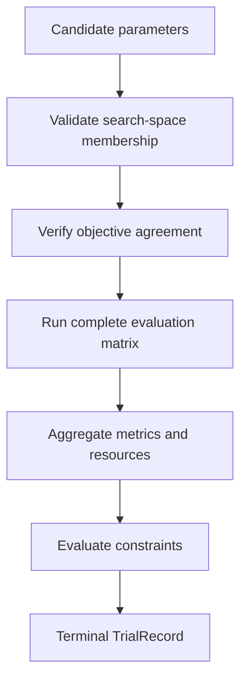
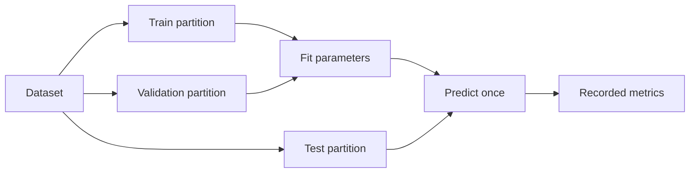
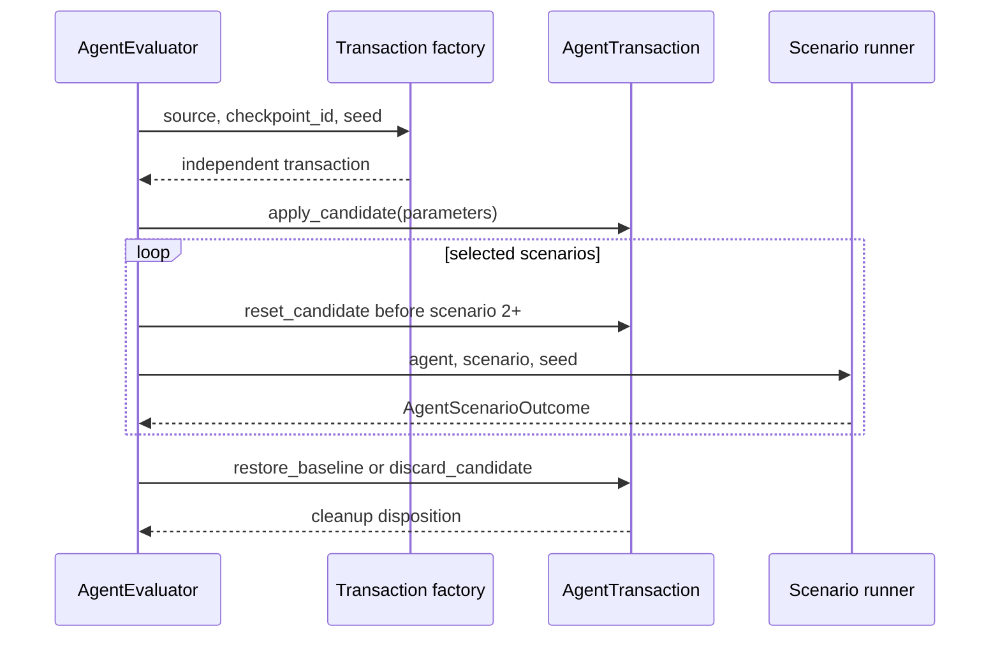
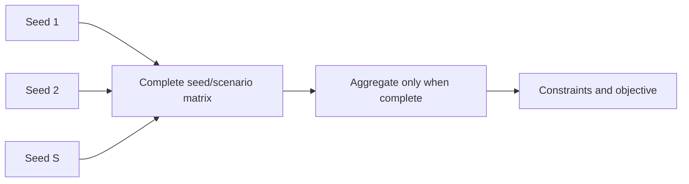

# Tuning evaluators

`src/tuning/evaluators` converts one candidate configuration into a terminal,
auditable `TrialRecord`. It provides two evaluation regimes:

- leakage-resistant supervised evaluation over seeds and disjoint data splits;
- transactional agent evaluation over seeds and task/scenario suites.

Evaluators own measurement and state isolation. They do not select candidates,
rank the search history, promote a winner, deploy a model, or write run
artifacts.

## Shared boundary

Search strategies call a candidate evaluator with:

```python
def evaluate_candidate(
    request: TuningRunRequest,
    trial_id: str,
    parameters: Mapping[str, Any],
) -> TrialRecord:
    ...
```

The built-in evaluator methods are adapted to that boundary:

- supervised: `SupervisedEvaluator.evaluate(..., context)`;
- agent: `AgentEvaluator.evaluate(...)` or `evaluate_async(...)`.



Failed slices are retained as structured evidence. Neither evaluator drops a
failed fold, seed, or scenario and averages only the survivors.

## Supervised evaluation

`supervised.py` separates model fitting, early-stopping/model-selection data,
and final scoring data.



`SupervisedSplit` verifies that train, validation, and test indices are
non-empty, unique, non-negative, and pairwise disjoint. The test partition is
passed only to `predict()` and metric functions, not to the adapter's `fit()`
method.

### Supervised contracts

#### Model adapter

Implement `SupervisedAdapter`:

```python
class SupervisedAdapter(Protocol):
    def build(
        self,
        parameters: Mapping[str, Any],
        seed: int,
    ) -> Any: ...

    def fit(
        self,
        model: Any,
        x_train: Any,
        y_train: Any,
        x_validation: Any,
        y_validation: Any,
    ) -> Mapping[str, Any] | None: ...

    def predict(self, model: Any, x_test: Any) -> Any: ...
```

`CallableSupervisedAdapter` wraps three callables when a dedicated adapter
class would add no value. Signature inspection is not used: each callable must
accept exactly the documented arguments.

#### Metric functions

Metric functions receive `(y_true, y_pred)` and must return one finite real
scalar. The mapping must contain every metric named in
`supervised_evaluation.metrics`, including the objective. Metric direction is
defined by `MetricSpec`; the evaluator does not infer direction from a metric
name.

#### Optional split provider

A custom `SplitProvider(sample_count, seed)` may return a sequence of validated
`SupervisedSplit` objects. Use it for domain-specific grouping or temporal
rules that the built-in splitters cannot represent. The provider, not the
evaluator, is responsible for the scientific validity of those rules; the
evaluator still checks returned types and index bounds.

### Built-in split strategies

| Strategy | Implemented partitioning |
| --- | --- |
| `holdout` | Optional seed-based permutation followed by one train/validation/test partition using the configured fractions. |
| `nested_k_fold` | Seed-based optional permutation, outer-fold test rotation, and a validation subset taken from each remaining outer-training partition. |
| `time_series` | Expanding historical training window with its latest fraction reserved for validation and the next contiguous block used for testing; shuffling is prohibited. |

The identifier `nested_k_fold` is the configuration/API name. The current
implementation does not run a separate inner K-fold search; it creates a
disjoint validation subset within each outer-training partition. Documenting
this distinction prevents the evaluation design from being overstated.

### Supervised configuration

```yaml
supervised_evaluation:
  objective:
    name: rmse
    direction: minimize
    unit: null

  metrics: [rmse, mae, r2]
  seeds: [11, 29, 47]
  split_strategy: nested_k_fold
  validation_fraction: 0.15
  test_fraction: 0.20
  n_splits: 5
  shuffle: true
  constraints: []
```

| Field | Invariant |
| --- | --- |
| `objective` | Concrete name and direction; must agree with the request and occur in `metrics`. |
| `metrics` | Non-empty, unique names with a corresponding callable for each name. |
| `seeds` | Unique integers. Request seeds override these defaults when supplied. |
| `validation_fraction` | Finite value in `(0, 0.5)`. |
| `test_fraction` | Finite value in `(0, 1)`; for holdout, its sum with `validation_fraction` must be below `1`. |
| `n_splits` | Integer at least `2`. |
| `shuffle` | Boolean; must be `false` for time-series evaluation. |
| `constraints` | Explicit post-aggregation eligibility rules. |

### Supervised aggregation

Suppose metric $m$ has values $m_1,\ldots,m_N$ over every completed
seed/split slice. The evaluator reports:

$$
\bar m = \frac{1}{N}\sum_{i=1}^{N}m_i,
\qquad
s_m = \sqrt{\frac{1}{N}\sum_{i=1}^{N}(m_i-\bar m)^2}.
$$

The code uses population standard deviation (`ddof=0`). It also calculates the
mean per seed, then reports population standard deviation and standard error
over those seed means:

$$
\[
\mathrm{SEM}_{\text{seed}}
= \frac{s_{\text{seed}}}{\sqrt{S}},
\]
$$

where $S$ is the number of evaluated seeds.

For each configured metric `name`, the output contains:

- `name`;
- `name_std`;
- `name_seed_std`;
- `name_seed_sem`.

It also contains `evaluation_count`. Trial resources include total wall time,
slice count, and observed slice latency quantiles `p50`, `p95`, and `p100`.

Every slice must succeed and expose the same metric set before aggregation.
Consequently, a failing split fails the candidate rather than reducing the
denominator.

### Supervised integration example

```python
from src.tuning.evaluators.supervised import (
    CallableSupervisedAdapter,
    SupervisedEvaluationConfig,
    SupervisedEvaluationContext,
    SupervisedEvaluator,
)
from src.tuning.networks.dense_neural_network import DenseNeuralNetwork

evaluation_config = SupervisedEvaluationConfig.from_mapping(
    config["supervised_evaluation"]
)

adapter = CallableSupervisedAdapter(
    builder=lambda parameters, seed: DenseNeuralNetwork.from_tuning_params(
        input_dim=input_dim,
        output_dim=output_dim,
        parameters=parameters,
        base_config=config["dnn"],
        seed=seed,
    ),
    fitter=lambda model, x_train, y_train, x_validation, y_validation: (
        model.fit_for_tuning(
            x_train,
            y_train,
            x_validation,
            y_validation,
        )
    ),
    predictor=lambda model, x_test: model.predict(x_test),
)

evaluator = SupervisedEvaluator(
    adapter=adapter,
    metric_functions=metric_functions,
    config=evaluation_config,
)
data_context = SupervisedEvaluationContext(x=x, y=y)

def evaluate_candidate(request, trial_id, parameters):
    return evaluator.evaluate(
        request,
        trial_id,
        parameters,
        data_context,
    )
```

`metric_functions`, `input_dim`, `output_dim`, `x`, and `y` are integration
inputs. They are intentionally not inferred by the tuning package.

## Agent evaluation

`agent.py` evaluates mutable agents through explicit state transactions. It is
designed for agents whose evaluator can change model weights, optimizer state,
memory, policy state, meta-parameters, or other live state.

### Transaction lifecycle

Each seed receives a separate transaction from the configured checkpoint or a
freshly constructed state. The candidate is applied once, reset before every
scenario after the first, and cleaned up after that seed even if evaluation
fails.



`reset_candidate()` must restore the state captured immediately after
`apply_candidate()`. This makes scenario observations within a seed independent
of mutations introduced by earlier scenarios.

### Agent contracts

#### Transaction factory

```python
def transaction_factory(
    source: AgentStateSource,
    checkpoint_id: str | None,
    seed: int,
) -> AgentTransaction | Awaitable[AgentTransaction]:
    ...
```

The factory creates a transaction but does not apply the candidate.

#### Transaction

An `AgentTransaction` exposes:

```python
transaction_id: str
source: AgentStateSource
baseline_checkpoint_id: str | None
agent: Any

apply_candidate(parameters)
reset_candidate()
restore_baseline()
discard_candidate()
```

Each lifecycle method may be synchronous or awaitable. The evaluator verifies
the transaction's structure, source, and requested checkpoint identity before
using it.

#### Scenario and runner

`AgentScenario` contains a unique `scenario_id`, an integration-defined
payload, and metadata. The runner contract is:

```python
def scenario_runner(
    agent: Any,
    scenario: AgentScenario,
    seed: int,
) -> AgentScenarioOutcome | Awaitable[AgentScenarioOutcome]:
    ...
```

`AgentScenarioOutcome` requires task utility, success, reported latency, safety
violations, and may include peak memory, a calibration observation, additional
finite metrics, and metadata. `confidence` and `correct` must either both be
present or both be absent.

### Agent configuration

```yaml
agent_evaluation:
  objective:
    name: task_utility
    direction: maximize
    unit: null

  seeds: [11, 29, 47]

  state:
    source: fresh
    checkpoint_id: null
    cleanup: auto

  calibration_bins: 10
  require_calibration: true
  fail_fast: true
  constraints: []
```

| Field | Invariant |
| --- | --- |
| `objective` | Concrete metric that must be produced and agree with the tuning request. |
| `seeds` | Non-empty sequence of unique integers. Request seeds override these defaults. |
| `state.source` | `fresh` or `checkpoint`. |
| `state.checkpoint_id` | Required for `checkpoint`; prohibited for `fresh` except `null` or an empty value. |
| `state.cleanup` | `auto`, `restore`, or `discard`. |
| `calibration_bins` | Integer at least `2`. |
| `require_calibration` | When true, every scenario outcome must provide `confidence` and `correct`. |
| `fail_fast` | Stop the remaining scenario/seed matrix after the first primary failure, while still executing cleanup. |
| `constraints` | Explicit rules evaluated after complete aggregation. |

### Cleanup semantics

| Configured cleanup | Checkpoint source | Fresh source |
| --- | --- | --- |
| `auto` | `restore_baseline()` | `discard_candidate()` |
| `restore` | `restore_baseline()` | `restore_baseline()` |
| `discard` | `discard_candidate()` | `discard_candidate()` |

A successful cleanup records `RESTORED` or `DISCARDED`. A cleanup exception
records `RESTORE_FAILED` or `DISCARD_FAILED`, fails the trial, and includes
`live_state_may_be_mutated: true` in structured error details. The evaluator
does not claim that state is isolated when cleanup cannot prove it.

### Agent evaluation matrix

For $S$ seeds and $K$ selected scenarios, successful aggregation requires the
complete matrix of $S\times K$ outcomes. Request `scenario_ids` may select an
ordered subset of registered scenarios; unknown identifiers are rejected.



### Agent metrics

Built-in aggregate metrics are computed from all outcomes:

| Metric | Definition |
| --- | --- |
| `task_utility` | Arithmetic mean of scenario task utility. |
| `success_rate` | Fraction of outcomes with `success: true`. |
| `safety_violation_count` | Total number of reported violation identifiers. |
| `safety_violation_rate` | Fraction of outcomes with one or more violations. |
| `latency_mean_seconds` | Mean reported scenario latency. |
| `latency_p95_seconds` | Empirical 0.95 quantile of reported latency. |
| `utility_seed_std` | Population standard deviation of mean task utility per seed. |
| `utility_seed_sem` | `utility_seed_std / sqrt(seed_count)`. |
| `peak_memory_bytes` | Maximum reported peak memory, only when every outcome is instrumented. |
| `calibration_coverage` | Fraction of outcomes providing a calibration pair. |
| `calibration_ece` | Weighted expected calibration error when calibration observations exist. |
| `calibration_brier` | Mean squared difference between confidence and binary correctness. |
| `evaluation_count` | Number of aggregated seed/scenario outcomes. |

Peak-memory coverage must be complete or absent; partial memory
instrumentation fails aggregation. Additional metric names must be identical
across every outcome. Each additional metric is reported as its mean and
population standard deviation (`name` and `name_std`). Reserved built-in metric
names cannot be overridden by `AgentScenarioOutcome.metrics`.

Expected calibration error uses equal-width confidence bins. For bins $B_b$,

$$
\operatorname{ECE}
= \sum_b \frac{|B_b|}{N}
  \left|\operatorname{acc}(B_b)
  - \operatorname{conf}(B_b)\right|.
$$

This measures empirical calibration for the supplied confidence/correctness
pairs. It does not manufacture probabilistic judgments for tasks that do not
provide them.

### Agent integration example

```python
from src.tuning.evaluators.agent import (
    AgentEvaluationConfig,
    AgentEvaluator,
)

evaluation_config = AgentEvaluationConfig.from_mapping(
    config["agent_evaluation"]
)

evaluator = AgentEvaluator(
    transaction_factory=transaction_factory,
    scenario_runner=scenario_runner,
    scenarios=scenarios,
    config=evaluation_config,
)

def evaluate_candidate(request, trial_id, parameters):
    return evaluator.evaluate(request, trial_id, parameters)
```

Inside an existing event loop, use an asynchronous candidate-evaluation path
that awaits `evaluator.evaluate_async(...)`. Calling `evaluate()` inside an
active event loop is rejected to prevent nested event-loop execution.

The tuning package does not provide a universal `transaction_factory` or
`scenario_runner`: checkpoint identity, state capture, parameter application,
agent invocation, and safety observations depend on the concrete SLAI agent.

## Constraints and terminal status

Constraints are evaluated only after complete aggregation. Each
`MetricConstraint` names an aggregate metric, comparison operator, and finite
threshold.

- all constraints pass: `TrialStatus.SUCCEEDED`;
- any constraint fails: `TrialStatus.REJECTED`;
- evaluation, aggregation, contract, or cleanup fails:
  `TrialStatus.FAILED`.

A rejected trial retains metrics and constraint observations but is not
eligible for promotion. A failed trial retains every completed evaluation
slice and structured error available at the failure boundary.

Constraint thresholds express external policy. The evaluators intentionally do
not derive acceptable safety, latency, memory, utility, or calibration limits
from the observed candidate set.

## Reproducibility and interpretation

- Prespecify seeds and scenario/data selection before running the study.
- Keep the full evaluation matrix; do not select seeds or scenarios based on
  observed performance.
- Treat repeated seeds and folds as dependence-aware evidence, not automatically
  independent samples.
- Interpret population standard deviations and seed SEM in the context of the
  actual sampling design.
- Use representative, versioned datasets and scenario suites.
- Validate that metric functions and scenario outcomes measure the intended
  construct.
- Require state cleanup evidence before considering a mutable-agent trial for
  promotion.

The evaluators provide disciplined measurement mechanics. They do not establish
that a dataset is unbiased, a scenario suite is complete, a safety metric is
sufficient, or a promotion threshold is justified.

## Verification

From the repository root:

```powershell
py -m src.tuning.evaluators.supervised
py -m src.tuning.evaluators.agent
```

Production integration tests should also exercise the concrete model adapter,
custom split provider if used, transaction factory, checkpoint restore,
fresh-state discard, scenario runner, partial instrumentation rejection,
cleanup failure, synchronous execution, and asynchronous execution.
