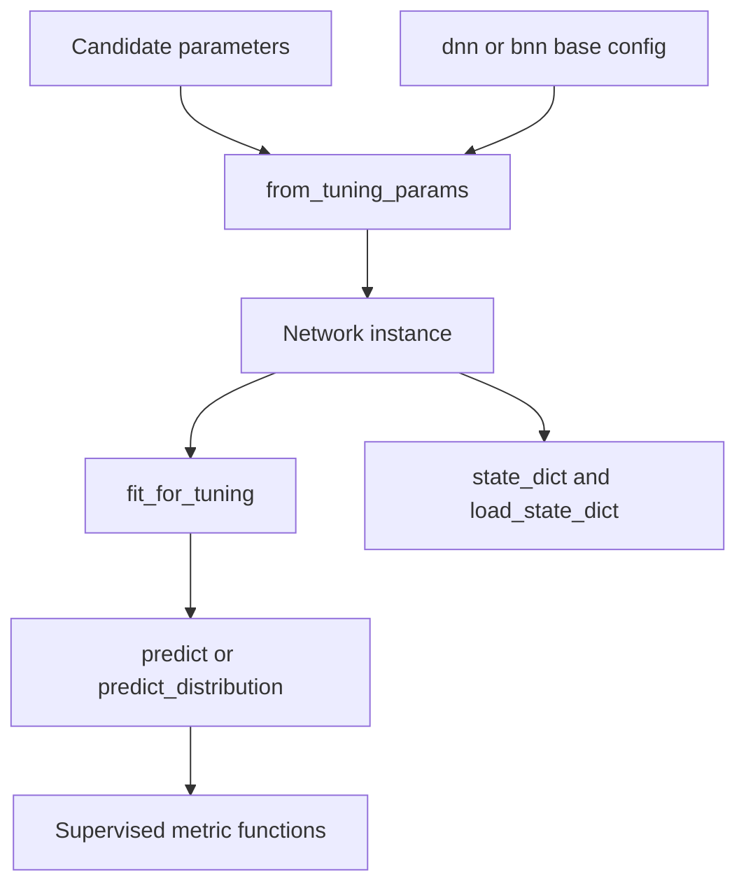
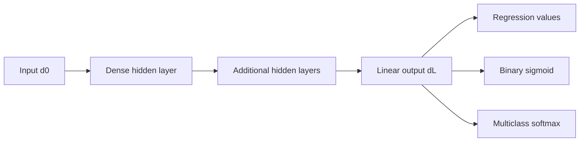

# Reference neural networks for tuning

`src/tuning/networks` contains two NumPy reference implementations used by the
SLAI supervised tuning adapters:

- `DenseNeuralNetwork`: deterministic fully connected network;
- `BayesianNeuralNetwork`: mean-field variational fully connected network with
  Monte Carlo predictive uncertainty.

The network name describes the statistical model, not the search algorithm.
Either network can be tuned by grid search, Bayesian search, or a future
strategy without changing its implementation. This is why the deterministic
module is named `dense_neural_network.py`, not `grid_neural_network.py`.

## Scope

The network modules own:

- validated network and optimizer configuration;
- parameter initialization and forward/backward computation;
- mini-batch Adam optimization;
- validation-based early stopping;
- prediction and task-specific metrics;
- tuning-parameter adaptation; and
- explicit, resumable state.

They do not load global configuration, split datasets, choose candidates,
evaluate agent scenarios, promote candidates, deploy models, or write tuning
artifacts.



## Model comparison

| Property | `DenseNeuralNetwork` | `BayesianNeuralNetwork` |
| --- | --- | --- |
| Parameter representation | Point estimates for weights and biases | Independent Gaussian variational posterior for every weight and bias |
| Training objective | Task data loss with L2 weight regularization | Monte Carlo data loss plus closed-form Gaussian KL divergence |
| Regularization | L2, dropout, gradient clipping, early stopping | Gaussian prior, variational KL, gradient clipping, early stopping |
| Predictive uncertainty | Not represented probabilistically | Monte Carlo epistemic uncertainty; regression also adds configured Gaussian likelihood noise |
| Prediction cost | One forward pass | Multiple sampled forward passes |
| State | Parameters, Adam moments, RNG, training metadata | Posterior parameters, Adam moments, RNG, training metadata |
| Core dependency | NumPy | NumPy |

The Bayesian model is not intrinsically better for every task. Its additional
uncertainty information is useful only when the variational family, likelihood,
data, and calibration are appropriate for the application.

## Shared architecture

For layer sizes $(d_0,d_1,\ldots,d_L)$, both models use fully connected affine
layers:

$$
z^{(\ell)} = h^{(\ell-1)}W^{(\ell)} + b^{(\ell)},
\qquad
h^{(\ell)} = \phi\!\left(z^{(\ell)}\right),
$$

with a linear output layer. Hidden activation $\phi$ is one of `relu`, `tanh`,
or `leaky_relu`. Output interpretation depends on `task_type`.



### Task and output requirements

| `task_type` | Required output dimension | `predict()` | `predict_proba()` |
| --- | --- | --- | --- |
| `regression` | One or more | Continuous output; a single output is flattened to one dimension | Rejected |
| `binary_classification` | Exactly `1` | Thresholded class labels | Sigmoid probability |
| `multiclass_classification` | At least `2` | `argmax` class labels | Softmax probabilities |

Input features must be a finite two-dimensional array with shape
`(samples, input_dim)`. Target preparation validates count, shape, finiteness,
and task-specific label structure.

## Dense neural network

### Objective and optimization

For regression, the training data loss is half mean squared error over output
dimensions. Binary classification uses stable binary cross-entropy from
logits, and multiclass classification uses categorical cross-entropy.

The weight gradient includes L2 regularization:

$$
\nabla_W \mathcal{L}_{\text{total}}
= \nabla_W \mathcal{L}_{\text{data}} + \lambda W.
$$

Training uses inverted dropout on hidden activations, global gradient-norm
clipping when configured, and Adam updates with bias correction. Dropout is
disabled for validation and prediction.

Validation loss controls early stopping. When `restore_best_weights` is true,
the model restores the best validation state observed before returning.

### Dense configuration

```yaml
dnn:
  task_type: regression
  learning_rate: 0.001
  hidden_activation: relu
  leaky_relu_slope: 0.01
  weight_init_scale: 1.0
  gradient_clip_norm: 5.0
  l2_lambda: 1.0e-4
  dropout_rate: 0.10
  beta1: 0.9
  beta2: 0.999
  adam_epsilon: 1.0e-8
  prediction_threshold: 0.5
  stability_epsilon: 1.0e-8
  random_state: 42

  training:
    epochs: 120
    batch_size: 64
    shuffle: true
    early_stopping_patience: 12
    min_delta: 1.0e-4
    restore_best_weights: true
```

| Field | Constraint and role |
| --- | --- |
| `learning_rate` | Positive Adam step size. |
| `hidden_activation` | `relu`, `tanh`, or `leaky_relu`. |
| `leaky_relu_slope` | Positive negative-region slope for leaky ReLU. |
| `weight_init_scale` | Positive scale applied to fan-in-aware initialization. |
| `gradient_clip_norm` | Positive global norm or `null` to disable clipping. |
| `l2_lambda` | Finite non-negative L2 coefficient. |
| `dropout_rate` | Finite value in `[0, 1)`. |
| `beta1`, `beta2` | Adam decay factors in `(0, 1)`. |
| `adam_epsilon` | Positive numerical-stability term. |
| `prediction_threshold` | Binary threshold in `(0, 1)`. |
| `stability_epsilon` | Positive floor used in stable probability calculations. |
| `random_state` | Integer or `null`; initializes the instance-local NumPy generator. |

`DenseNetworkConfig.from_mapping()` rejects unknown fields except the nested
`training` and `monitoring` sections, which are not constructor fields.

### Dense outputs

`DenseNeuralNetwork.evaluate()` reports:

| Task | Metrics |
| --- | --- |
| Regression | `mse`, `rmse`, `mae` |
| Binary classification | `accuracy`, `log_loss`, `brier` |
| Multiclass classification | `accuracy`, `log_loss` |

`DenseTrainingHistory` retains epoch numbers, training and validation loss,
gradient norm, best epoch, best validation loss, early-stopping flag, and total
optimizer steps.

## Bayesian neural network

### Variational parameterization

The Bayesian network represents each scalar parameter $\theta_i$ with an
independent Gaussian variational posterior:

$$
q(\theta_i) = \mathcal{N}(\mu_i,\sigma_i^2),
\qquad
\sigma_i = \operatorname{softplus}(\rho_i).
$$

Sampling uses the reparameterization estimator:

$$
\theta_i = \mu_i + \sigma_i\epsilon_i,
\qquad
\epsilon_i \sim \mathcal{N}(0,1).
$$

The prior is a shared Gaussian configured by `prior_mu` and `prior_logvar`.
For a dataset of size $N$, the implemented negative evidence lower bound is
estimated as

$$
\mathcal{J}
= \mathbb{E}_{q(\theta)}[-\log p(y\mid x,\theta)]
  + \frac{1}{N}\operatorname{KL}\!\left(q(\theta)\,\|\,p(\theta)\right).
$$

The KL contribution is evaluated in closed form for diagonal Gaussian
posteriors and the Gaussian prior. The expected data term is approximated with
the configured number of Monte Carlo samples.

For regression, the likelihood is Gaussian with fixed configured standard
deviation `likelihood_std`. Classification uses Bernoulli or categorical data
loss as appropriate.

### Bayesian configuration

```yaml
bnn:
  task_type: regression
  learning_rate: 0.005
  prior_mu: 0.0
  prior_logvar: 0.0
  posterior_rho_init: -3.0
  likelihood_std: 1.0
  hidden_activation: relu
  leaky_relu_slope: 0.01
  weight_init_scale: 0.75
  gradient_clip_norm: 5.0
  beta1: 0.9
  beta2: 0.999
  adam_epsilon: 1.0e-8
  prediction_threshold: 0.5
  stability_epsilon: 1.0e-8
  random_state: 42

  training:
    epochs: 200
    batch_size: 64
    num_samples: 5
    validation_num_samples: 20
    shuffle: true
    early_stopping_patience: 15
    min_delta: 1.0e-4
    restore_best_weights: true

  prediction:
    num_samples: 200
    lower_quantile: 0.05
    upper_quantile: 0.95
```

| Bayesian-specific field | Constraint and role |
| --- | --- |
| `prior_mu` | Finite Gaussian prior mean. |
| `prior_logvar` | Finite log variance that must exponentiate to a finite positive variance. |
| `posterior_rho_init` | Finite initial unconstrained posterior scale parameter. |
| `likelihood_std` | Positive fixed observation-noise standard deviation for regression. |
| `num_samples` | Positive Monte Carlo sample count per training batch. |
| `validation_num_samples` | Positive Monte Carlo sample count for validation negative ELBO. |

Shared activation, Adam, clipping, threshold, stability, and random-state fields
have the same interpretation as in the dense network. `BayesianNetworkConfig`
does not contain dropout or L2 fields; regularization is supplied through its
prior and variational KL term.

`BayesianNetworkConfig.from_mapping()` rejects unknown fields except nested
`training`, `prediction`, and `monitoring` sections.

### Predictive distribution

`predict_distribution()` samples the variational posterior and returns:

| Key | Meaning |
| --- | --- |
| `mean` | Monte Carlo predictive mean. |
| `epistemic_std` | Population standard deviation across sampled predictions. |
| `lower`, `upper` | Empirical posterior-predictive sample quantiles. |
| `predictive_std` | Regression only: epistemic variance plus configured likelihood variance. |
| `predictive_lower`, `predictive_upper` | Regression only: Gaussian intervals derived from `predictive_std`. |

For regression,

$$
\sigma_{\text{predictive}}
= \sqrt{\sigma_{\text{epistemic}}^2
       + \sigma_{\text{likelihood}}^2}.
$$

The empirical `lower` and `upper` arrays summarize sampled model predictions;
the regression `predictive_lower` and `predictive_upper` additionally include
the configured Gaussian observation noise. These are model-based uncertainty
summaries, not guaranteed frequentist coverage bounds.

`BayesianNeuralNetwork.evaluate()` reports:

| Task | Metrics |
| --- | --- |
| Regression | `mse`, `rmse`, `mae`, `predictive_nll`, `mean_epistemic_std` |
| Binary classification | `accuracy`, `log_loss`, `brier`, `mean_epistemic_std` |
| Multiclass classification | `accuracy`, `log_loss`, `mean_epistemic_std` |

`BayesianTrainingHistory` retains negative ELBO, data loss, KL per observation,
gradient norm, validation negative ELBO, best epoch, early-stopping state, and
total optimizer steps.

## Construction and tuning integration

### Direct construction

Layer sizes always include input and output dimensions:

```python
from src.tuning.networks.dense_neural_network import (
    DenseNetworkConfig,
    DenseNeuralNetwork,
)

model = DenseNeuralNetwork(
    layer_sizes=(input_dim, 128, 64, output_dim),
    config=DenseNetworkConfig(
        task_type="regression",
        random_state=42,
    ),
)
```

The Bayesian constructor has the same layer-size convention and accepts
`BayesianNetworkConfig`.

### Candidate construction

`from_tuning_params()` separates constructor parameters from fit parameters:

```python
model = DenseNeuralNetwork.from_tuning_params(
    input_dim=input_dim,
    output_dim=output_dim,
    parameters=parameters,
    base_config=config["dnn"],
    seed=seed,
)

fit_metadata = model.fit_for_tuning(
    x_train,
    y_train,
    x_validation,
    y_validation,
)
```

`hidden_layer_sizes` accepts a positive integer, comma-delimited string, or
sequence of positive integers. Unknown candidate parameters are rejected.
Constructor parameters update the validated model config; recognized training
parameters are stored in `tuning_fit_parameters` and consumed by
`fit_for_tuning()`.

The Bayesian network follows the same pattern and additionally recognizes
`num_samples` and `validation_num_samples` as fit parameters.

### Search-space ownership

Network defaults belong under `dnn` or `bnn`. Candidate alternatives belong
under `hyperparameters.<ModelType>`. For example:

```yaml
hyperparameters:
  DenseNeuralNetwork:
    - name: hidden_layer_sizes
      type: categorical
      values:
        - [64]
        - [128, 64]

    - name: dropout_rate
      type: real
      values: [0.0, 0.1]
```

The network does not read this section itself. The tuner and search strategy
select parameters, and the supervised adapter passes them to
`from_tuning_params()`.

## State and checkpoint integration

Both networks implement `state_dict()` and transactional `load_state_dict()`.
State schema version `1` includes:

- layer sizes and validated model configuration;
- trainable parameters;
- Adam first and second moments;
- optimizer step count;
- last gradient norm and evaluation metrics;
- tuning fit parameters; and
- instance RNG state.

Bayesian state stores posterior means and `rho` parameters for weights and
biases. Dense state stores point-estimate weights and biases.

`load_state_dict()` validates schema, architecture, configuration, collection
lengths, tensor shapes, finiteness, optimizer metadata, and RNG state before
committing any changes. A malformed state therefore does not partially replace
the current network.

The returned mapping is a model-state contract, not a persistence format by
itself. A checkpoint subsystem or agent transaction adapter decides how it is
serialized, versioned, stored, restored, and audited.

## Reproducibility and numerical interpretation

- Each instance owns a NumPy random generator seeded by `random_state`.
- Tuning construction can override the base seed per evaluation seed.
- Model state includes RNG state, allowing optimization and sampling to resume
  from the captured point.
- All inputs, targets, state arrays, and reported metrics must be finite.
- Global gradient clipping protects against excessive update norms but does not
  guarantee convergence.
- Early stopping depends on the supplied validation partition and does not
  replace independent final-test evaluation.
- Bayesian Monte Carlo estimates depend on sample count and seed; report these
  with experimental results.

The Bayesian implementation uses a diagonal mean-field posterior and a shared
Gaussian prior. It does not represent posterior correlations between
parameters. Its uncertainty estimates should be calibrated and stress-tested
on the intended data distribution before they inform deployment decisions.

## Verification

The network modules do not define `__main__` comprehensive self-tests. A basic
import smoke check from the repository root is:

```powershell
py -c "from src.tuning.networks.dense_neural_network import DenseNeuralNetwork; `
from src.tuning.networks.bayesian_neural_network import BayesianNeuralNetwork; `
print('network imports passed')"
```

This checks imports only. Repository-level unit and integration tests should
cover every task type, shape and label validation, deterministic replay, state
round-trips, rejected malformed state, early stopping, tuning-parameter
separation, Bayesian sample-count behavior, and evaluator integration on
disjoint train/validation/test partitions.
