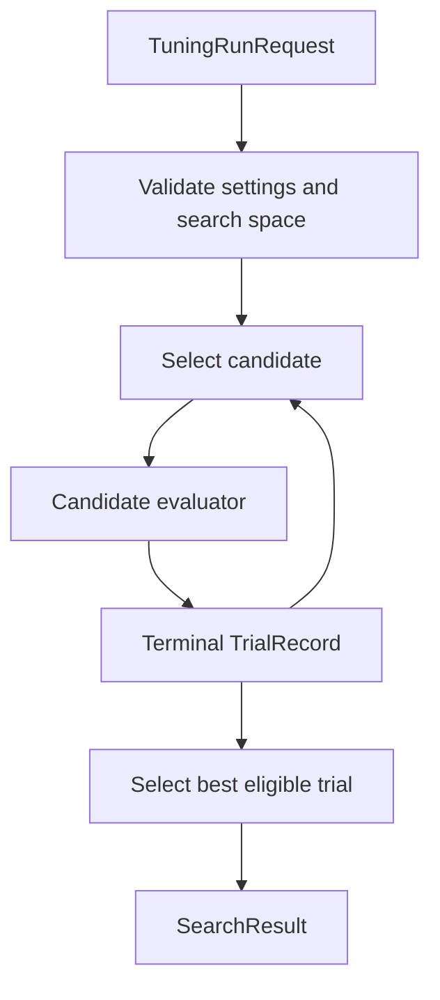
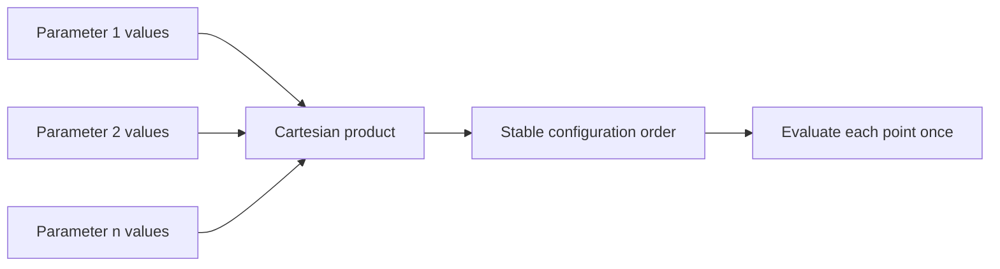
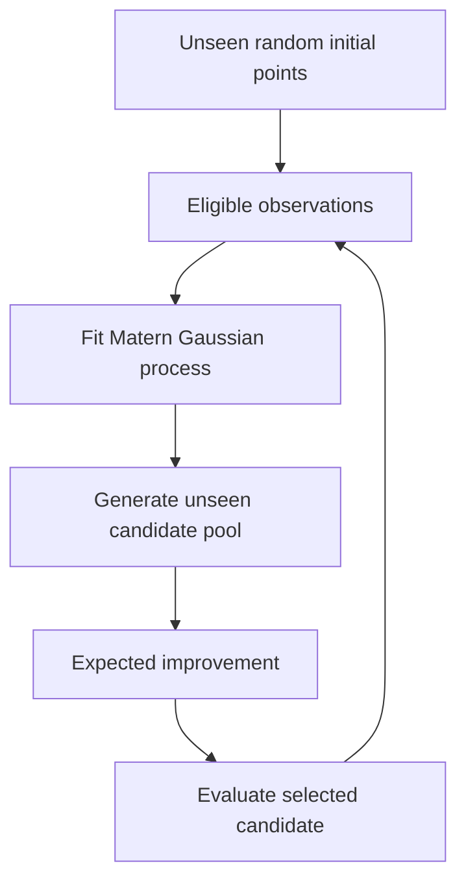

# Tuning search strategies

`src/tuning/search` contains candidate-selection algorithms. Both strategies
consume the same `TuningRunRequest`, invoke the same candidate evaluator
contract, preserve every terminal `TrialRecord`, and return the same
`SearchResult` representation.

Search is intentionally unaware of model construction, datasets, agent state,
checkpoint formats, promotion thresholds, deployment, and artifact storage.
Those responsibilities belong to evaluators, policies, and writers.

## Strategy boundary



The loop ends when the grid is exhausted, the Bayesian trial budget is
reached, a finite Bayesian space is exhausted, or `fail_fast` stops the run
after a failed trial.

## Shared candidate evaluator contract

Both strategies resolve `evaluation_context` in one of three forms:

1. a callable;
2. an object with a callable `evaluate_candidate` method; or
3. a mapping with a callable under `candidate_evaluator`.

The callable signature is exact:

```python
def evaluate_candidate(
    request: TuningRunRequest,
    trial_id: str,
    parameters: Mapping[str, Any],
) -> TrialRecord:
    ...
```

The returned trial must:

- use the request's `run_id`;
- use the strategy-assigned `trial_id`;
- preserve the candidate parameters exactly under their stable fingerprint;
- be terminal and satisfy `validate_trial_record()`;
- expose the configured objective in both `metrics` and `objective_value` when
  successful; and
- retain failure, constraint, resource, and state-isolation evidence.

An invalid callback result becomes a failed trial. Bare numeric objective
values are deliberately unsupported because they discard the evidence needed
for agent safety and reproducibility.

## Available strategies

| Strategy | Implementation | Selection model | Primary use |
| --- | --- | --- | --- |
| Grid | `grid.py` | Deterministic Cartesian enumeration | Finite, auditable spaces where complete or deliberately bounded coverage is practical. |
| Bayesian | `bayesian.py` | Gaussian-process surrogate with expected improvement | Expensive evaluations where sequential, evidence-guided candidate selection is useful. |

Neither strategy is universally superior. The choice depends on evaluation
cost, search-space cardinality, continuity assumptions, and the importance of
exhaustive coverage.

## Grid search

`GridSearch` enumerates parameters in configuration order and evaluates each
Cartesian combination exactly once unless `fail_fast` stops the run.



### Grid definitions

Grid parameters can use explicit `values`. Numeric parameters can alternatively
use inclusive `min`, `max`, and positive `step` bounds.

```yaml
hyperparameters:
  DenseNeuralNetwork:
    - name: hidden_layer_sizes
      type: categorical
      values:
        - [64]
        - [128, 64]

    - name: learning_rate
      type: real
      values: [0.0005, 0.001, 0.003]

    - name: epochs
      type: integer
      min: 80
      max: 120
      step: 20
```

Real-valued stepped ranges are constructed with decimal arithmetic before
conversion to floats, avoiding cumulative binary floating-point increments.
A bounded real grid must use a uniform prior; logarithmic grids must be
declared explicitly with `values`.

### Grid settings

```yaml
grid_search:
  fail_fast: false
  max_combinations: null
```

| Field | Meaning |
| --- | --- |
| `fail_fast` | Stop after the first failed trial while retaining all evidence produced up to that point. |
| `max_combinations` | Optional positive upper bound checked before evaluation. `null` permits the complete Cartesian product. |

The total cardinality is

$$
N_{\text{grid}} = \prod_{j=1}^{d} |\mathcal{X}_j|,
$$

where $\mathcal{X}_j$ is the declared value set for dimension $j$. The result
metadata records total and evaluated combinations, whether enumeration
completed exhaustively, and parameter order.

## Bayesian search

`BayesianSearch` performs sequential optimization using random initial
candidates followed by a Gaussian-process surrogate and expected-improvement
acquisition.



### Implemented model

Only the following combination is accepted by the current implementation:

- acquisition: `expected_improvement`;
- surrogate: scikit-learn `GaussianProcessRegressor`;
- kernel: a constant kernel multiplied by a Matérn kernel;
- configurable Matérn $\nu$, observation noise, output normalization, and
  optimizer restarts.

For minimization, expected improvement uses

$$
\operatorname{EI}(x)
= (f_\star - \mu(x) - \xi)\Phi(z)
  + \sigma(x)\phi(z),
$$

with

$$
z = \frac{f_\star - \mu(x) - \xi}{\sigma(x)}.
$$

$f_\star$ is the best eligible observed objective, $\mu(x)$ and $\sigma(x)$
are the surrogate prediction, and $\xi$ is the configured exploration term.
Maximization objectives are sign-transformed internally so the same
minimization-form acquisition can be used without changing the externally
reported objective.

Only eligible trials train the surrogate. Failed or constraint-rejected trials
remain in the run evidence but are not treated as valid objective observations.
Until the configured initial phase is complete—or fewer than two eligible
observations exist—the strategy selects unseen random candidates.

### Dimension encoding and sampling

| Dimension | Sampling | Surrogate encoding |
| --- | --- | --- |
| Categorical | Uniform choice from `values` | One-hot encoding using stable value fingerprints. |
| Numeric with explicit `values` | Uniform choice from the declared values | Ordinal position scaled to `[0, 1]`. |
| Bounded integer | Discrete uniform sample including both bounds | Linear scaling to `[0, 1]`. |
| Bounded real, uniform | Continuous uniform sample | Linear scaling to `[0, 1]`. |
| Bounded real, log-uniform | Uniform sample in log space | Log-space scaling to `[0, 1]`. |

The ordinal encoding of numeric `values` assumes their declared order is
meaningful. Categorical alternatives, including hidden-layer layouts, should
use `type: categorical` so no artificial numeric ordering is imposed.

Every candidate is fingerprinted and evaluated at most once. When all
dimensions have explicit finite values, the strategy falls back to canonical
Cartesian enumeration to determine exact exhaustion. Bounded continuous spaces
cannot be proven exhausted by finite enumeration.

### Bayesian settings

```yaml
bayesian_search:
  n_trials: 40
  n_initial_points: 8
  random_state: 42
  candidate_pool_size: 1024
  fail_fast: false

  acquisition:
    name: expected_improvement
    exploration: 0.01

  surrogate:
    kernel: matern
    matern_nu: 2.5
    normalize_y: true
    noise: 1.0e-6
    optimizer_restarts: 2
```

| Field | Constraint and effect |
| --- | --- |
| `n_trials` | Positive maximum number of evaluated candidates. |
| `n_initial_points` | Positive random-design count not exceeding `n_trials`. |
| `random_state` | Integer or `null`; seeds candidate sampling and the surrogate optimizer. |
| `candidate_pool_size` | Positive number of unseen proposals considered per acquisition step. |
| `fail_fast` | Stop after the first failed trial. |
| `acquisition.exploration` | Finite non-negative $\xi$ in expected improvement. |
| `surrogate.matern_nu` | Matérn smoothness: `0.5`, `1.5`, `2.5`, or positive infinity. |
| `surrogate.normalize_y` | Whether the Gaussian process normalizes observed objectives. |
| `surrogate.noise` | Positive diagonal regularization supplied as `alpha`. |
| `surrogate.optimizer_restarts` | Non-negative hyperparameter optimizer restart count. |

Bayesian search imports scikit-learn only when the surrogate is first fitted.
Random initial trials can therefore execute before that dependency boundary,
but a full Bayesian run requires scikit-learn once model-guided selection
begins.

Convergence warnings from Gaussian-process fitting do not erase candidate
evidence. Their count is retained in result metadata and summarized as a search
warning. A surrogate fitting exception is a tuning optimization error.

## Objective resolution

The normal path supplies a concrete `MetricSpec` in `TuningRunRequest` from the
central `tuning.objective`. For backward compatibility, a strategy can resolve
an objective from its own strategy section when the request objective is
absent. Current centralized configurations should not rely on that fallback.

Objective direction determines only ranking and surrogate orientation. The
strategy never derives direction from the metric name.

## Best-trial and run status semantics

Both strategies select the best trial only from
`trial.eligible_for_promotion` candidates.

| Condition | Search status |
| --- | --- |
| At least one eligible trial and no failed trials | `SUCCEEDED` |
| At least one eligible trial and at least one failed trial | `DEGRADED` |
| No eligible trial | `FAILED` |

A rejected trial does not become the best trial. A failed trial remains in the
result. `validate_search_result()` independently checks that no eligible trial
is better than the declared best trial.

## Direct use

Normally `HyperparamTuner` resolves and dispatches the strategy. Direct use is
available for integration tests and custom orchestration:

```python
from src.tuning.search.grid import run_search

search_result = run_search(
    request,
    {"candidate_evaluator": evaluate_candidate},
)
```

`request` must already be a valid `TuningRunRequest` whose
`settings.strategy` matches the selected module.

## Adding a strategy

A new strategy should preserve the existing boundary rather than creating a
new evaluator interface:

1. Define and validate strategy-only settings.
2. Validate the search space with `validate_search_space()` or an explicitly
   compatible extension.
3. Resolve the standard candidate evaluator.
4. assign deterministic, unique trial identifiers;
5. verify returned run identity, trial identity, parameters, and trial
   structure;
6. preserve all terminal trial evidence;
7. choose the best eligible trial using `MetricSpec.direction`; and
8. return a complete `SearchResult`.

Search modules must not promote candidates, persist artifacts, infer safety
thresholds, or mutate an agent outside an evaluator transaction.

## Verification

From the repository root:

```powershell
py -m src.tuning.search.grid
py -m src.tuning.search.bayesian
```

Integration tests should additionally cover evaluator contract violations,
mixed successful/failed/rejected trials, finite-space exhaustion,
`max_combinations`, objective direction, deterministic seeding, and missing
Bayesian dependencies.
