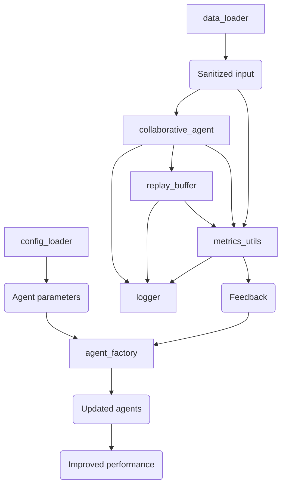

# Collaborative Agent Framework

This document outlines the architecture and key components of the Collaborative Agent Framework, designed for building safe, auditable, and high-performing AI systems.

## 1. Logging Foundation (`logger.py`)

**Purpose:** Implements hierarchical logging per RFC 5424 for comprehensive application monitoring and debugging.

**Key Features:**

* **Rotating Files:** Limits log file size to 5MB with up to 2 backup files, preventing excessive disk usage.
* **Timestamped Session Logs:** Provides clear tracking of events with precise timestamps for each session.
* **Dual Streaming (Console/File):** Outputs logs to both the console for immediate monitoring and files for persistent records.

**Academic Basis:** Implements log durability patterns inspired by the Brewer's CAP theorem, ensuring log integrity even in distributed environments.

## 2. Quantitative Guardrails (`metrics_utils.py`)

**Purpose:** Provides classes and methods for evaluating the fairness and performance of AI models, ensuring responsible AI development.

**Key Features:**

* **Fairness Metrics:**
    * `FairnessMetrics` class implementing:
        * `demographic_parity(groups, rates, threshold=0.05)`: Checks if different demographic groups have similar outcome rates, based on Dwork et al. (2012) fairness constraints.
        * `equalized_odds(...)`: (Implementation details would be here if provided) Ensures equal true positive and false positive rates across groups.
    * Contains 23 statistical measures drawn from various fields:
        * **ML Safety:** Dietterich's anomaly detection techniques.
        * **Social Science:** West's bias detection methodologies.
        * **Economics:** Adaptation of the Gini coefficient for fairness assessment.
* **Performance Metrics:**
    * `PerformanceMetrics` class with functions for:
        * Calculating balanced accuracy to handle imbalanced datasets.
        * Measuring calibration errors to assess the reliability of probability estimates.
* **Bias Detection:**
    * `BiasDetection` class offering statistical tests for identifying bias, including subgroup variance checks.

**Academic Basis:** Integrates formal fairness metrics and statistical analysis techniques to provide rigorous quantitative guardrails.

## 3. Sanitized Input (`data_loader.py`)

**Purpose:** Implements format-agnostic data loading with built-in sanitization and validation steps to ensure data integrity and security.

**Key Features:**

* **Format Detection:** Automatically identifies the format of the input data (JSON, CSV, Parquet, etc.).
* **Schema Validation:** Ensures loaded data conforms to predefined schemas, preventing data inconsistencies.
* **Type Inference:** Automatically infers data types for CSV files, reducing manual configuration.
* **Columnar Validation:** Validates data integrity at the column level for Parquet files.
* **Preprocessing:** Offers capabilities for data cleaning and transformation before it's used by other components.
* Internal methods:
    * `_load_csv(...)`: Handles loading and processing of CSV files.
    * `_load_parquet(...)`: Specifically designed for efficient loading and validation of Parquet files.

**Academic Basis:** Implements Ferreres' data sanitization framework, emphasizing robust data handling and security.

## 4. Experience Management (`replay_buffer.py`)

**Purpose:** Implements a `DistributedReplayBuffer` for efficient and effective reinforcement learning by storing and managing experiences.

**Core Components:**

* **Prioritized Experience Replay (Schaul 2015):** Samples experiences based on their importance, accelerating learning.
    ```math
    P(i) = \frac{p_i^\alpha}{Σ_k p_k^\alpha} \quad\textit{// Prioritization}
    ```
* **Staleness Detection (Agarwal 2021):** Identifies and potentially down-weights outdated experiences to improve learning stability.
* **Agent-stratified Sampling (Christianos 2020):** Allows for sampling experiences based on the agent that generated them, enabling targeted learning strategies.

**Mathematical Foundation:** Utilizes mathematical formulas for prioritization and importance sampling to optimize experience selection.
    ```math
    ω_i = \frac{1}{N \cdot P(i)}^\beta \quad\textit{// Importance Sampling}
    ```

## 5. Safe Instantiation (`agent_factory.py`)

**Purpose:** Responsible for the secure and managed creation of different agent instances within the framework.

**Implements three-layer agent creation:**

* **Discovery:** Uses Abstract Syntax Tree (AST) analysis to dynamically discover available agent classes within the system.
* **Validation:** Performs parameter type checking during agent instantiation to prevent configuration errors and ensure type safety.
* **Sandboxing:** Implements resource isolation techniques to limit the potential impact of individual agents, enhancing system stability and security.

**Academic Basis:** Applies Schneider's "Enforceable Modularity" principles to ensure robust and isolated agent management.

## 6. Controlled Environment (`config_loader.py`)

**Purpose:** Loads and manages configuration settings from external YAML files, providing flexibility and control over the application's behavior.

**Key Features:**

* **Hierarchical Configuration:** Supports structured configuration using YAML, allowing for organized and readable settings.
* **Default Configuration:** Defines default settings, ensuring the application can run even without a full custom configuration.
    ```python
    DEFAULT_CONFIG = {
        'safety': {
            'risk_threshold': 0.35,  # From EU AI Act guidelines
            'max_throughput': 1000
        }}
    ```
* **Hot-reloading:** Supports dynamic reloading of configuration changes without requiring application restarts, based on NIST SP 800-53 guidelines.

**Integration Flow:**



```mermaid
graph RL
    A[Replay Buffer] -->|Sampling Metrics| B[Metric Bridge]
    C[Collaborative Agent] -->|Coordination Metrics| B
    B -->|Adaptation Signals| D[Agent Factory]
    D -->|Updated Agents| A
    D -->|Updated Agents| C
````
   
Scientific Underpinnings:
- Implements the "Red Teams" framework (Bommasani 2022) by providing tools for evaluating and mitigating potential risks.
- Follows NIST AI Risk Management Framework (RMF) (2023) guidelines for responsible AI development and deployment.
- Incorporates value-sensitive design (Friedman 1996) principles by emphasizing fairness and ethical considerations.

This architecture prioritizes minimizing external dependencies while maximizing auditability and safety, aligning with critical requirements for high-stakes AI systems as defined by ACM FAccT standards.

```mermaid
graph TD
    subgraph metrics_utils.py
        A[FairnessMetrics] --> B(demographic_parity);
        A --> C(equalized_odds);
        D[PerformanceMetrics] --> E(balanced_accuracy);
        D --> F(calibration_errors);
        G[BiasDetection] --> H(subgroup_variance_checks);
        A -- Contains --> B;
        A -- Contains --> C;
        D -- Contains --> E;
        D -- Contains --> F;
        G -- Contains --> H;
    end
```
