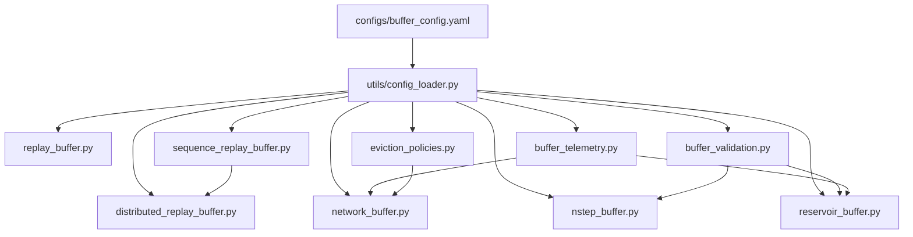
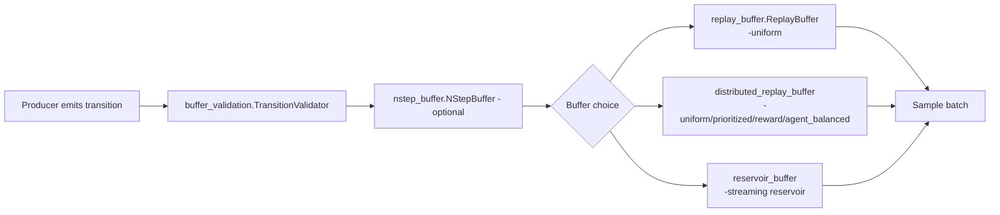
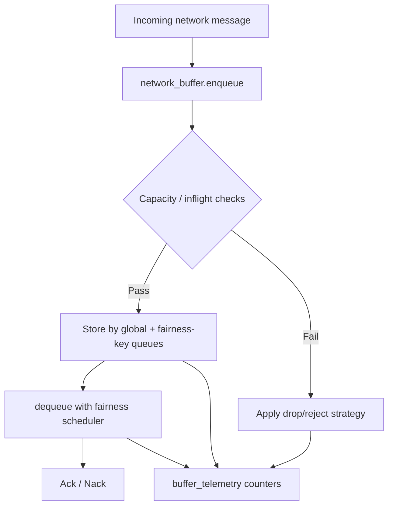
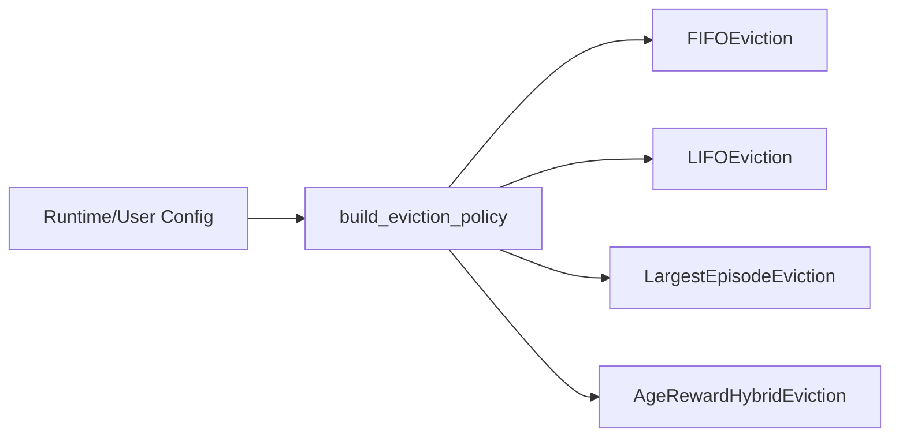

# Buffer Subsystem (`src/utils/buffer`)

This document explains the buffer modules in `src/utils/buffer`, their roles, and their strengths, and includes diagrams to visualize how the pieces fit together.

---

## 1) Design goals

The buffer subsystem is built to support reinforcement learning and networked agent workloads with:

- **Reliable storage and retrieval** of transitions/messages.
- **Flexible sampling strategies** (uniform, prioritized, reward-based, agent-balanced, and reservoir).
- **Fairness and observability hooks** for operational quality.
- **Composable primitives** (validation, telemetry, segment trees, and eviction policies) used by higher-level buffers.

---

## 2) Module map

| Module | Primary Role | Main Strengths |
|---|---|---|
| `replay_buffer.py` | Minimal uniform replay buffer | Very simple API, low overhead, easy baseline |
| `distributed_replay_buffer.py` | Production-oriented multi-strategy replay | Prioritized sampling, staleness pruning, fairness checks, persistence |
| `network_buffer.py` | Transport-facing queue with backpressure and fairness | Drop strategies, TTL expiration, weighted fairness scheduling, inflight limits |
| `nstep_buffer.py` | Converts 1-step transitions into n-step returns | Better credit assignment, terminal-aware truncation, thread-safe queueing |
| `reservoir_buffer.py` | Streaming replay via reservoir sampling | Unbiased retention over unbounded streams, fixed memory |
| `sequence_replay_buffer.py` | Segment tree primitives for fast range ops | Efficient sum/min aggregation and prefix-sum index lookup |
| `eviction_policies.py` | Pluggable eviction heuristics | FIFO/LIFO/largest/hybrid options with config-driven selection |
| `buffer_validation.py` | Transition schema validation + coercion | Early data integrity guarantees, batch validation reports |
| `buffer_telemetry.py` | In-memory metrics and timing collection | Thread-safe counters/observations, latency instrumentation |
| `utils/config_loader.py` | Shared config loading utilities | Centralized YAML section retrieval across modules |
| `utils/buffer_errors.py` | Shared error definitions | Consistent exception semantics |

---

## 3) Detailed module explanations

### 3.1 `replay_buffer.py`

**Role**
- Implements a classic replay buffer backed by a bounded `deque`.
- Supports push + random uniform sample.

**Strengths**
- Extremely simple, predictable behavior.
- Good default for prototypes and smoke-testing RL pipelines.
- Minimal dependencies and small cognitive overhead.

**When to use**
- You only need uniform random sampling and bounded memory.
- You prefer a lightweight baseline before introducing more advanced policies.

---

### 3.2 `distributed_replay_buffer.py`

**Role**
- Provides a more advanced replay buffer for multi-agent/distributed training contexts.
- Tracks metadata (timestamps, priorities, per-agent statistics, fairness indicators).

**Strengths**
- **Multiple sampling strategies:**
  - `uniform`
  - `prioritized` (with importance weights)
  - `reward`
  - `agent_balanced`
- **Staleness management:** removes expired/aged experiences based on threshold.
- **Fairness instrumentation:** demographic parity checks on sampled batches.
- **Persistence support:** `save()`/`load()` with metadata.
- **Health reporting:** model-card style summarization.

**When to use**
- You need richer sampling control and production-like observability.
- Multi-agent workloads require distribution-aware or fairness-aware sampling.

---

### 3.3 `network_buffer.py`

**Role**
- Acts as a network-facing buffering layer for incoming/outgoing message traffic.
- Separates transport backpressure concerns from model-side replay logic.

**Strengths**
- **Backpressure strategies:** drop oldest/newest/lowest-priority, random early drop, reject new, or policy-driven eviction.
- **Fairness controls:** weighted round robin style key scheduling with per-key credits.
- **Operational guardrails:** high/low watermarks, per-key inflight limits, TTL expiration.
- **Telemetry integration:** enqueue/dequeue/drop/backpressure metrics and latency timing.

**When to use**
- You need deterministic queue behavior under burst traffic.
- You have multi-tenant channels and want fairness + controlled overload handling.

---

### 3.4 `nstep_buffer.py`

**Role**
- Converts incoming 1-step transitions into n-step transitions:
  - Aggregates discounted rewards over a configurable window.
  - Propagates terminal handling and final next-state semantics.

**Strengths**
- Improves training signal by encoding multi-step return information.
- Supports early terminal flush and optional clear-on-terminal behavior.
- Thread-safe and validator-backed for robust ingestion.

**When to use**
- You train value-based methods benefiting from n-step returns.
- You want a preprocessing stage before writing to replay storage.

---

### 3.5 `reservoir_buffer.py`

**Role**
- Implements fixed-size reservoir sampling for streaming data.
- Ensures every seen sample has equal probability of retention.

**Strengths**
- Unbiased retention for unbounded streams with constant memory footprint.
- Useful when input volume is unknown or very large.
- Includes validation + telemetry hooks and supports sampling with/without replacement.

**When to use**
- Data arrives continuously and you cannot store everything.
- You need statistically fair retention over long-running streams.

---

### 3.6 `sequence_replay_buffer.py`

**Role**
- Provides reusable segment tree data structures (`SegmentTree`, `SumSegmentTree`, `MinSegmentTree`) and factory utilities.

**Strengths**
- Efficient range reduction operations.
- Fast prefix-sum index lookup (key primitive for prioritized replay implementations).
- Capacity normalization to power-of-two for simpler/index-safe tree arithmetic.

**When to use**
- You need scalable aggregate queries for priorities or sequence-level scoring.
- You are building/optimizing prioritized replay internals.

---

### 3.7 `eviction_policies.py`

**Role**
- Defines policy abstractions and concrete eviction strategies.
- Supplies config-aware policy builder.

**Strengths**
- Swappable policies without changing caller logic.
- Includes heuristics for different workload shapes:
  - FIFO: oldest-first eviction.
  - LIFO: newest-first eviction.
  - Largest episode: frees capacity quickly.
  - Age-reward hybrid: balances recency and reward signal.

**When to use**
- Buffer pressure is expected and eviction needs to be tunable.
- You want workload-specific capacity recovery behavior.

---

### 3.8 `buffer_validation.py`

**Role**
- Validates and sanitizes transition payloads against a schema.
- Offers both single-transition and batch validation flows.

**Strengths**
- Prevents malformed experience tuples from contaminating training.
- Configurable constraints (length, reward numeric checks, done boolean checks, optional limits).
- Structured validation reporting for diagnostics.

**When to use**
- Input quality is variable or comes from heterogeneous producers.
- You want explicit fail-fast behavior for bad transitions.

---

### 3.9 `buffer_telemetry.py`

**Role**
- Collects thread-safe counters, observations, and operation timings.
- Exposes snapshots and NumPy-friendly exports.

**Strengths**
- Lightweight and embeddable in all buffer modules.
- Context-manager timing blocks simplify latency instrumentation.
- Useful bridge between runtime monitoring and analysis workflows.

**When to use**
- You need module-level metrics without adopting a full metrics stack.
- You want quick introspection for performance tuning.

---

### 3.10 `utils/config_loader.py` and `utils/buffer_errors.py`

**Role**
- `config_loader.py`: loads global YAML and returns section-scoped config.
- `buffer_errors.py`: defines shared exceptions used by validation-oriented modules.

**Strengths**
- Centralized configuration behavior across all buffers.
- Consistent exception vocabulary for callers and tests.

---

## 4) Structural diagrams

### 4.1 High-level dependency graph

> Note: `sequence_replay_buffer.py` provides segment tree primitives intended for prioritized/sequence workloads; it is an enabling component in the subsystem architecture.

### 4.2 Experience ingestion flow (training path)

### 4.3 Network buffering and backpressure flow

### 4.4 Eviction policy selection

---

## 5) Practical selection guide

- Use **`ReplayBuffer`** when you need a fast, minimal baseline.
- Use **`DistributedReplayBuffer`** when you need advanced sampling + fairness/health instrumentation.
- Use **`ReservoirReplayBuffer`** for high-volume streaming with strict memory caps.
- Use **`NStepBuffer`** as a preprocessing stage before any replay store.
- Use **`NetworkBuffer`** for transport-layer fairness and backpressure control.
- Use **segment tree and eviction modules** as internal building blocks for tuned policies.

---

## 6) Consistency notes

To keep implementation and documentation consistent across this subsystem:

1. Maintain the canonical transition shape:
   `(agent_id, state, action, reward, next_state, done)`.
2. Keep config in `configs/buffer_config.yaml` and retrieve via `utils/config_loader.py`.
3. Wire validation (`TransitionValidator`) at module boundaries that ingest external payloads.
4. Emit telemetry around latency-sensitive paths (`push`, `sample`, `enqueue`, `dequeue`).
5. Use eviction strategies via `build_eviction_policy(...)` instead of hardcoding policy classes in call sites.

