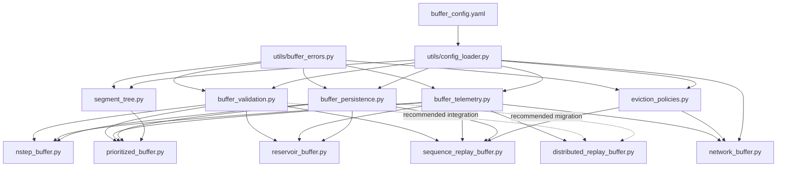
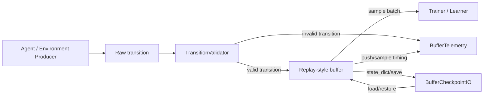
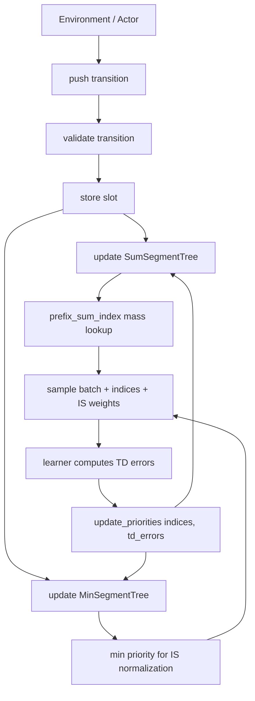
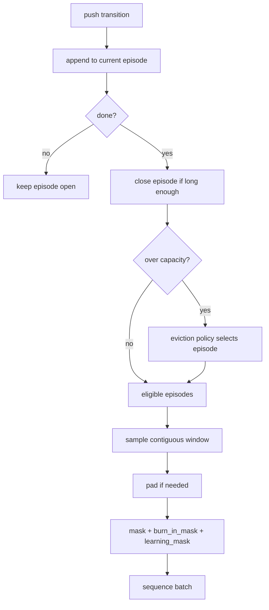
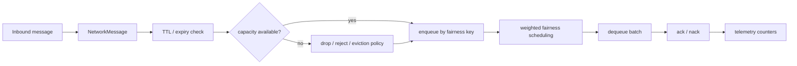
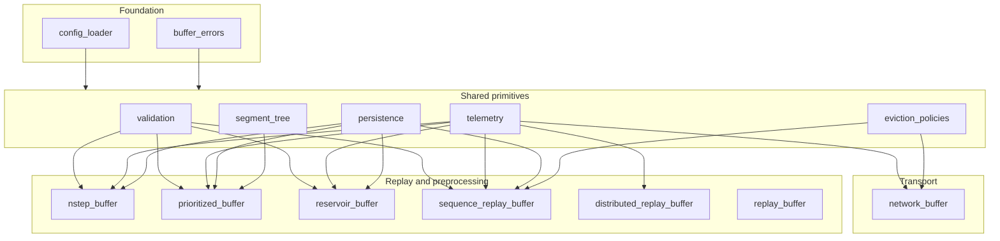

# Buffer Subsystem (`src/utils/buffer`)

The buffer subsystem provides reusable storage, sampling, validation, telemetry, persistence, and backpressure primitives for reinforcement-learning and networked-agent workloads. It is designed as a layered utility package: low-level helpers enforce configuration, validation, error semantics, metrics, checkpoints, segment-tree priority storage, and eviction policy selection; higher-level buffers compose those primitives for uniform replay, prioritized replay, distributed replay, sequence replay, n-step return construction, reservoir sampling, and network-facing queues.

---

## 1) Design goals

The subsystem is built around the following goals:

- **Correct replay semantics:** store transitions consistently and sample them using the appropriate strategy for the training workload.
- **Clear specialization boundaries:** keep single-node PER, distributed replay, reservoir sampling, sequence replay, n-step preprocessing, and network buffering separate instead of forcing every behavior into one module.
- **Centralized validation:** normalize replay transitions before they contaminate training buffers.
- **Centralized error handling:** use the shared buffer error hierarchy instead of local `ValueError`, `IndexError`, or ad-hoc exceptions.
- **Observable runtime behavior:** track push latency, sample latency, lock contention, rejection rates, stale-prune counts, and checkpoint timing.
- **Versioned persistence:** save and load buffer state through one checkpoint service instead of each buffer inventing a brittle format.
- **Config-driven behavior:** load all buffer settings from `buffer_config.yaml` through `utils/config_loader.py`.
- **Composable primitives:** reuse segment trees, eviction policies, telemetry, validation, and persistence across high-level buffers.

---

## 2) Canonical transition contract

Most replay-oriented modules use the same canonical transition format:

```python
(agent_id, state, action, reward, next_state, done)
```

Field meaning:

| Field | Meaning | Validation responsibility |
|---|---|---|
| `agent_id` | Producer, actor, environment, or agent identifier | `buffer_validation.py` |
| `state` | Current observation/state payload | `buffer_validation.py` |
| `action` | Action selected for the state | `buffer_validation.py` |
| `reward` | Numeric reward value | `buffer_validation.py` |
| `next_state` | Next observation/state payload | `buffer_validation.py` |
| `done` | Episode terminal flag | `buffer_validation.py` |

The canonical validator may accept tuple/list transitions and, when enabled, mapping-style transitions. It normalizes rewards, validates terminal flags, rejects invalid payloads, and returns structured validation reports for batch ingestion.

---

## 3) Module map

| Module | Main owner | Primary role | Typical consumers |
|---|---:|---|---|
| `replay_buffer.py` | `ReplayBuffer` | Minimal uniform replay baseline backed by a bounded `deque`. | Smoke tests, prototypes, simple off-policy loops. |
| `distributed_replay_buffer.py` | `DistributedReplayBuffer` | Multi-strategy replay for distributed or multi-agent workloads. | Multi-agent trainers, fairness-aware replay, reward/prioritized strategy experiments. |
| `prioritized_buffer.py` | `PrioritizedReplayBuffer` | Dedicated single-node Prioritized Experience Replay implementation. | Clean PER benchmarks and trainer pipelines needing explicit TD-error updates. |
| `reservoir_buffer.py` | `ReservoirReplayBuffer` | Statistically unbiased fixed-memory reservoir for long or unbounded streams. | Continual learning, online telemetry, data streams with unknown length. |
| `sequence_replay_buffer.py` | `SequenceReplayBuffer` | Episode-grouped contiguous sequence replay with padding and masks. | RNN, Transformer, recurrent policy/value training. |
| `nstep_buffer.py` | `NStepBuffer` | Converts 1-step transitions into n-step returns. | DQN-style preprocessing, value-learning pipelines. |
| `network_buffer.py` | `NetworkBuffer` | Transport-facing queue with TTL, backpressure, fairness, and inflight controls. | Network adapters, agent communication, burst handling. |
| `segment_tree.py` | `SegmentTree`, `SumSegmentTree`, `MinSegmentTree` | O(log N) range aggregation and priority lookup primitives. | Prioritized replay and any priority-mass sampling logic. |
| `eviction_policies.py` | `EvictionPolicy` implementations | Config-driven capacity pressure policies. | Sequence replay, network buffer, custom replay storage. |
| `buffer_validation.py` | `TransitionValidator` | Transition schema validation, coercion, and batch reports. | Replay, PER, reservoir, sequence, n-step. |
| `buffer_telemetry.py` | `BufferTelemetry` | Runtime metrics, timings, lock contention, rejection rates, and summaries. | All production buffer modules. |
| `buffer_persistence.py` | `BufferCheckpointIO` | Versioned checkpoint save/load with compression, checksums, and adapter hooks. | Reservoir, sequence, n-step, PER, distributed replay migration. |
| `utils/buffer_errors.py` | `BufferError` hierarchy | Shared structured exceptions and guards. | Every buffer-facing module. |
| `utils/config_loader.py` | `load_global_config`, `get_config_section` | Thread-safe YAML config loading and section retrieval. | Every config-driven module. |

---

## 4) Buffer import hierarchy

The buffer package is intentionally layered. Low-level utility modules should not import higher-level replay implementations. High-level buffers may depend on shared utilities, but shared utilities should remain business-logic free.

### 4.1 Layered import tree

```text
src/utils/buffer/
├── utils/
│   ├── config_loader.py          # YAML loading and section access
│   └── buffer_errors.py          # canonical buffer exception hierarchy
│
├── shared primitives
│   ├── buffer_validation.py      # depends on config_loader + buffer_errors
│   ├── buffer_telemetry.py       # depends on config_loader + buffer_errors
│   ├── buffer_persistence.py     # depends on config_loader + buffer_errors
│   ├── segment_tree.py           # depends on config_loader + buffer_errors
│   └── eviction_policies.py      # depends on config_loader + buffer_errors
│
├── preprocessing buffers
│   └── nstep_buffer.py           # validation + telemetry + persistence
│
├── replay buffers
│   ├── replay_buffer.py          # minimal baseline, intentionally small
│   ├── prioritized_buffer.py     # validation + telemetry + persistence + segment trees
│   ├── reservoir_buffer.py       # validation + telemetry + persistence
│   ├── sequence_replay_buffer.py # validation + telemetry + persistence + eviction
│   └── distributed_replay_buffer.py # multi-strategy replay + fairness telemetry
│
└── transport buffers
    └── network_buffer.py         # telemetry + eviction + config-driven backpressure
```

### 4.2 Dependency graph


```mermaid
graph TD
    CFG[buffer_config.yaml] --> CL[utils/config_loader.py]
    ERR[utils/buffer_errors.py] --> VAL[buffer_validation.py]
    ERR --> TEL[buffer_telemetry.py]
    ERR --> PERSIST[buffer_persistence.py]
    ERR --> TREE[segment_tree.py]
    ERR --> EVICT[eviction_policies.py]
    CL --> VAL
    CL --> TEL
    CL --> PERSIST
    CL --> TREE
    CL --> EVICT

    VAL --> NSTEP[nstep_buffer.py]
    TEL --> NSTEP
    PERSIST --> NSTEP

    VAL --> PER[prioritized_buffer.py]
    TEL --> PER
    PERSIST --> PER
    TREE --> PER

    VAL --> RES[reservoir_buffer.py]
    TEL --> RES
    PERSIST --> RES

    VAL --> SEQ[sequence_replay_buffer.py]
    TEL --> SEQ
    PERSIST --> SEQ
    EVICT --> SEQ

    TEL --> DIST[distributed_replay_buffer.py]
    VAL -. recommended integration .-> DIST
    PERSIST -. recommended migration .-> DIST

    TEL --> NET[network_buffer.py]
    EVICT --> NET
    CL --> NET
```

### 4.3 Import boundary rules

- `utils/config_loader.py` must remain the only config-loading authority.
- `utils/buffer_errors.py` must remain side-effect-light and should not import buffer implementations.
- `buffer_validation.py`, `buffer_telemetry.py`, `buffer_persistence.py`, `segment_tree.py`, and `eviction_policies.py` are shared primitives. They should not depend on high-level buffers.
- Replay modules may import shared primitives, but shared primitives should not import replay modules.
- `prioritized_buffer.py` should own single-node PER. `distributed_replay_buffer.py` may keep a prioritized strategy for distributed workloads, but it should not be the only PER implementation.
- `sequence_replay_buffer.py` should own episode/sequence windows. `segment_tree.py` should own tree primitives.

---

## 5) Runtime data-flow diagrams

### 5.1 Standard replay ingestion flow


```mermaid
flowchart LR
    Producer[Agent / Environment Producer]
    Raw[Raw transition]
    Validator[TransitionValidator]
    Buffer[Replay-style buffer]
    Telemetry[BufferTelemetry]
    Checkpoint[BufferCheckpointIO]
    Trainer[Trainer / Learner]

    Producer --> Raw --> Validator
    Validator -- valid transition --> Buffer
    Validator -- invalid transition --> Telemetry
    Buffer -- sample batch --> Trainer
    Buffer -- push/sample timing --> Telemetry
    Buffer -- state_dict/save --> Checkpoint
    Checkpoint -- load/restore --> Buffer
```

### 5.2 Prioritized replay loop


```mermaid
flowchart TD
    Env[Environment / Actor] --> Push[push transition]
    Push --> Validate[validate transition]
    Validate --> Store[store slot]
    Store --> SumTree[update SumSegmentTree]
    Store --> MinTree[update MinSegmentTree]

    SumTree --> SampleMass[prefix_sum_index mass lookup]
    SampleMass --> Batch[sample batch + indices + IS weights]
    MinTree --> Weights[min priority for IS normalization]
    Weights --> Batch
    Batch --> Learner[learner computes TD errors]
    Learner --> Update[update_priorities indices, td_errors]
    Update --> SumTree
    Update --> MinTree
```

### 5.3 Sequence replay flow


```mermaid
flowchart TD
    Push[push transition] --> Episode[append to current episode]
    Episode --> Done{done?}
    Done -- no --> Continue[keep episode open]
    Done -- yes --> Close[close episode if long enough]
    Close --> Capacity{over capacity?}
    Capacity -- yes --> Evict[eviction policy selects episode]
    Capacity -- no --> Ready[eligible episodes]
    Evict --> Ready
    Ready --> Window[sample contiguous window]
    Window --> Pad[pad if needed]
    Pad --> Masks[mask + burn_in_mask + learning_mask]
    Masks --> Batch[sequence batch]
```

### 5.4 Network buffer flow


```mermaid
flowchart LR
    Inbound[Inbound message] --> Normalize[NetworkMessage]
    Normalize --> TTL[TTL / expiry check]
    TTL --> Capacity{capacity available?}
    Capacity -- yes --> Enqueue[enqueue by fairness key]
    Capacity -- no --> Backpressure[drop / reject / eviction policy]
    Backpressure --> Enqueue
    Enqueue --> Fairness[weighted fairness scheduling]
    Fairness --> Dequeue[dequeue batch]
    Dequeue --> AckNack[ack / nack]
    AckNack --> Metrics[telemetry counters]
```

---

## 6) Detailed module explanations

### 6.1 `replay_buffer.py` — minimal uniform replay

**Owner:** `ReplayBuffer`

`ReplayBuffer` is the simplest replay implementation in the package. It stores transitions in a bounded `deque` and samples uniformly with Python's random sampling. It intentionally has a small API and minimal dependencies.

**Use it when:**

- You need a quick baseline.
- You want a smoke-test buffer for training loops.
- You do not need validation, priorities, persistence, telemetry, or multi-agent scheduling.

**Main API:**

```python
buffer = ReplayBuffer(capacity=10000)
buffer.push(transition)
batch = buffer.sample(batch_size=32)
```

---

### 6.2 `distributed_replay_buffer.py` — multi-strategy distributed replay

**Owner:** `DistributedReplayBuffer`

`DistributedReplayBuffer` is the broad replay implementation for multi-agent or distributed training contexts. It tracks timestamps, priorities, per-agent experience counts, per-agent reward statistics, fairness summaries, and several sampling strategies.

**Supported sampling strategies:**

- `uniform`
- `prioritized`
- `reward`
- `agent_balanced`

**Use it when:**

- Sampling must account for agents/producers.
- You need staleness pruning.
- You need reward-based or agent-balanced sampling.
- You are evaluating fairness or distribution health across sampled batches.

**Important distinction:**

`DistributedReplayBuffer` can support prioritized sampling as one strategy, but dedicated single-node PER benchmarking should use `PrioritizedReplayBuffer` from `prioritized_buffer.py`.

---

### 6.3 `prioritized_buffer.py` — single-node Prioritized Experience Replay

**Owner:** `PrioritizedReplayBuffer`

`PrioritizedReplayBuffer` is the dedicated non-distributed PER implementation. It uses proportional priority sampling, explicit TD-error updates, sum/min segment trees, and importance-sampling weights.

**Key APIs:**

```python
buffer.push(agent_id, state, action, reward, next_state, done, td_error=td_error)
sample = buffer.sample(batch_size=64, beta=0.4)
report = buffer.update_priorities(sample.indices, td_errors)
```

**Core behavior:**

- Stores validated replay transitions.
- Converts TD-errors into priorities using `alpha` and `epsilon`.
- Samples with prefix-sum mass lookup through `SumSegmentTree`.
- Uses `MinSegmentTree` for IS-weight normalization.
- Returns indices so the trainer can update priorities after learning.
- Supports checkpoint save/load through `BufferCheckpointIO`.

**Use it when:**

- You want a clean single-node PER benchmark.
- You need the classic `push → sample → update_priorities` loop.
- You do not need distributed/multi-agent sampling strategies.

---

### 6.4 `reservoir_buffer.py` — unbiased streaming replay

**Owner:** `ReservoirReplayBuffer`

`ReservoirReplayBuffer` is designed for unbounded streams where total stream size is unknown or too large to store. It uses standard reservoir sampling so every accepted item has equal probability of remaining in the fixed-size buffer.

**Core behavior:**

- Retains all items until capacity is reached.
- After capacity is reached, randomly replaces retained items with probability `capacity / total_seen`.
- Supports sampling with or without replacement.
- Tracks accepted, retained, replaced, skipped, and rejected items.
- Supports persistence with `state_dict()`, `save()`, and `load()`.

**Use it when:**

- Data arrives continuously.
- You need fixed memory usage.
- You care about unbiased retention over a long stream.
- You are collecting continual-learning or online telemetry samples.

---

### 6.5 `sequence_replay_buffer.py` — contiguous episode sequence replay

**Owner:** `SequenceReplayBuffer`

`SequenceReplayBuffer` stores transitions grouped by episode and samples contiguous windows for recurrent or attention-based models. It returns padded arrays plus masks so learners can separate burn-in context from learning steps.

**Core behavior:**

- Maintains a current open episode.
- Closes episodes when terminal transitions arrive or when explicitly flushed.
- Samples contiguous windows of `burn_in + sequence_length`.
- Returns `mask`, `burn_in_mask`, and `learning_mask`.
- Uses eviction policies to remove complete episodes when capacity pressure occurs.
- Persists state through `BufferCheckpointIO`.

**Use it when:**

- Training RNNs, GRUs, LSTMs, Transformers, or memory-based agents.
- You need sequence windows rather than independent transitions.
- You need padded sequences with explicit valid-step masks.

---

### 6.6 `nstep_buffer.py` — n-step return preprocessing

**Owner:** `NStepBuffer`

`NStepBuffer` converts validated 1-step transitions into n-step transitions. It is a preprocessing buffer rather than a replay store: it receives incoming transitions, emits ready n-step outputs, and can flush terminal tails.

**Core behavior:**

- Maintains a pending queue of transitions.
- Computes discounted n-step reward using `gamma`.
- Emits outputs when enough transitions are available or terminal flushing is triggered.
- Preserves final `next_state` and terminal status.
- Supports batch ingestion diagnostics and persistence.

**Use it when:**

- You want richer credit assignment before writing to replay.
- Your trainer expects n-step returns.
- You need terminal-aware truncated returns.

---

### 6.7 `network_buffer.py` — transport queue and backpressure buffer

**Owner:** `NetworkBuffer`

`NetworkBuffer` is not an RL replay buffer. It is a transport-facing queue for messages, channels, protocols, fairness keys, and backpressure. It separates network pressure from training replay logic.

**Core behavior:**

- Normalizes messages into `NetworkMessage` records.
- Supports TTL expiration.
- Supports weighted fairness scheduling by fairness key.
- Enforces optional per-key inflight limits.
- Handles capacity pressure with configured drop strategies or eviction policy integration.
- Emits queue depth, enqueue/dequeue, drop, ack/nack, and backpressure telemetry.

**Use it when:**

- Agent communication can burst.
- Producers must be scheduled fairly.
- You need deterministic drop/reject behavior under pressure.
- Network transport should not leak into replay modules.

---

### 6.8 `segment_tree.py` — O(log N) priority storage primitives

**Owners:** `SegmentTree`, `SumSegmentTree`, `MinSegmentTree`, `PriorityTreeBundle`, `SegmentTreeFactory`

`segment_tree.py` owns tree-based priority aggregation. It is the canonical place for fast priority updates and prefix-sum sampling. Replay modules should import these primitives instead of duplicating tree logic.

**Core behavior:**

- Point update in O(log N).
- Range reduce in O(log N).
- Prefix-sum index lookup in O(log N).
- Sum-tree total mass for proportional sampling.
- Min-tree minimum priority for IS-weight normalization.

**Key PER APIs:**

```python
sum_tree.update(idx, priority)
idx = sum_tree.prefix_sum_index(mass)
min_priority = min_tree.min()
```

**Use it when:**

- You need prioritized replay sampling.
- You need fast priority mass lookup.
- You need stable range aggregation over fixed replay slots.

---

### 6.9 `eviction_policies.py` — capacity-pressure policies

**Owners:** `FIFOEviction`, `LeastSurpriseEviction`, `AgeRewardHybridEviction`, compatibility policies, and `build_eviction_policy`

`eviction_policies.py` provides reusable, config-driven eviction behavior. It is designed for modules that need to remove items under capacity pressure without hardcoding one eviction strategy.

**Canonical policies:**

- `FIFOEviction`: evicts the oldest item.
- `LeastSurpriseEviction`: keeps high-TD-error, rare, high-priority, or protected samples; evicts low-surprise/common samples first.
- `AgeRewardHybridEviction`: combines recency, reward strength, priority, terminal bonus, and protection signals.

**Compatibility policies:**

- `LIFOEviction`
- `LargestEpisodeEviction`

**Use it when:**

- A buffer stores complete episodes or messages and must reclaim capacity.
- Eviction strategy should be configurable.
- You want consistent capacity-pressure decisions across buffer modules.

---

### 6.10 `buffer_validation.py` — transition schema validation

**Owners:** `TransitionValidator`, `TransitionSchema`, `ValidationReport`, `TransitionValidationIssue`

`buffer_validation.py` validates and normalizes transition payloads before they are accepted into replay-like buffers. It prevents malformed rewards, terminal flags, missing states, invalid shapes, or bad batch entries from silently entering training data.

**Core behavior:**

- Accepts tuple/list transitions and optional mapping transitions.
- Validates canonical transition length.
- Coerces rewards and done flags when configured.
- Rejects NaN/Inf rewards unless explicitly allowed.
- Supports batch validation with structured reports.
- Records rejection rate and invalid indices.

**Use it when:**

- Producers are heterogeneous.
- Data quality matters.
- Bad transitions should be rejected early with diagnostic context.

---

### 6.11 `buffer_telemetry.py` — buffer metrics and diagnostics

**Owners:** `BufferTelemetry`, `MetricStats`, `MetricSummarizer`, `FairnessMetrics`

`buffer_telemetry.py` collects lightweight in-process metrics. It is intentionally embeddable and does not require a full external metrics stack.

**Canonical signals:**

- `push_latency_seconds`
- `sample_latency_seconds`
- `lock_wait_seconds`
- `lock_contention_count`
- `rejection_count`
- `stale_prune_count`

**Core behavior:**

- Thread-safe counters and observations.
- Bounded percentile history for p50, p95, and p99.
- Rejection rate tracking.
- Lock contention tracking.
- Slow operation diagnostics.
- Snapshot and NumPy export helpers.
- Fairness metric helpers for replay diagnostics.

**Use it when:**

- You need operational visibility without heavy dependencies.
- You want testable runtime metrics for buffers.
- You need a common metrics vocabulary across replay, network, and persistence modules.

---

### 6.12 `buffer_persistence.py` — shared checkpoint I/O

**Owners:** `BufferCheckpointIO`, `BufferCheckpoint`, `BufferCheckpointManifest`

`buffer_persistence.py` owns shared persistence so individual buffers do not each invent checkpoint formats. It writes a versioned checkpoint envelope with manifest metadata and serialized state.

**Core behavior:**

- Schema version tags.
- Stable checkpoint manifest.
- Payload and stored-payload SHA-256 checksums.
- Optional gzip compression.
- Hook-based encryption/decryption integration.
- Atomic writes.
- Backward-compatible adapter registration.
- Optional legacy `.npz` loading support.
- Telemetry for checkpoint saves, loads, payload size, and latency.

**Use it when:**

- Buffer state must survive process restarts.
- Checkpoints need explicit schema versions.
- Save/load behavior should be consistent across buffer modules.

---

### 6.13 `utils/buffer_errors.py` — centralized buffer exception hierarchy

**Owner:** `BufferError` hierarchy

`buffer_errors.py` defines the shared error language for the entire buffer subsystem. It should be used instead of duplicate module-local exception classes.

**Major domains:**

- configuration errors
- validation errors
- capacity and state errors
- sampling and priority errors
- network/backpressure errors
- n-step errors
- segment-tree errors
- eviction errors
- sequence replay errors
- telemetry/fairness errors
- persistence errors
- bulk operation errors

**Use it when:**

- A buffer operation needs to fail explicitly.
- Tests need to assert exact failure modes.
- Telemetry needs to classify errors consistently.

---

### 6.14 `utils/config_loader.py` — shared configuration access

**Owners:** `load_global_config`, `get_config_section`, `reload_config`, `clear_config_cache`

`config_loader.py` is the configuration authority for the buffer subsystem. Modules should keep using it directly rather than creating duplicate config loading code.

**Core behavior:**

- Resolves `buffer/configs/buffer_config.yaml` by default.
- Loads YAML safely.
- Caches loaded config with TTL and file modification checks.
- Provides section-level access through `get_config_section(...)`.
- Exposes cache diagnostics for debugging.

**Use it when:**

- A module needs values from `buffer_config.yaml`.
- Tests need to inspect or clear cached config state.
- Config access should remain consistent across all buffer modules.

---

## 7) Recommended imports

### 7.1 Baseline uniform replay

```python
from src.utils.buffer.replay_buffer import ReplayBuffer
```

### 7.2 Single-node prioritized replay

```python
from src.utils.buffer.prioritized_buffer import PrioritizedReplayBuffer

buffer = PrioritizedReplayBuffer()
buffer.push(agent_id, state, action, reward, next_state, done, td_error=1.0)
batch = buffer.sample(batch_size=64, beta=0.4)
update_report = buffer.update_priorities(batch.indices, td_errors)
```

### 7.3 Reservoir replay for unbounded streams

```python
from src.utils.buffer.reservoir_buffer import ReservoirReplayBuffer

buffer = ReservoirReplayBuffer()
buffer.push((agent_id, state, action, reward, next_state, done))
batch = buffer.sample(batch_size=128)
```

### 7.4 Sequence replay for recurrent/Transformer models

```python
from src.utils.buffer.sequence_replay_buffer import SequenceReplayBuffer

buffer = SequenceReplayBuffer()
buffer.push(agent_id, state, action, reward, next_state, done)
sequence_batch = buffer.sample_sequences(batch_size=16)
```

### 7.5 N-step preprocessing

```python
from src.utils.buffer.nstep_buffer import NStepBuffer

nstep = NStepBuffer()
maybe_transition = nstep.add((agent_id, state, action, reward, next_state, done))
ready_tail = nstep.flush()
```

### 7.6 Network buffer

```python
from src.utils.buffer.network_buffer import NetworkBuffer

network_buffer = NetworkBuffer()
decision = network_buffer.enqueue(payload, channel="agent", protocol="internal")
messages = network_buffer.dequeue(max_items=8)
```

### 7.7 Shared primitives

```python
from src.utils.buffer.buffer_validation import TransitionValidator
from src.utils.buffer.buffer_telemetry import BufferTelemetry
from src.utils.buffer.buffer_persistence import BufferCheckpointIO
from src.utils.buffer.segment_tree import SumSegmentTree, MinSegmentTree
from src.utils.buffer.eviction_policies import build_eviction_policy
```

---

## 8) Choosing the correct buffer

| Need | Recommended module |
|---|---|
| Minimal uniform sampling | `ReplayBuffer` |
| Single-node Prioritized Experience Replay | `PrioritizedReplayBuffer` |
| Explicit TD-error priority update loop | `PrioritizedReplayBuffer` |
| Multi-agent or distributed sampling strategies | `DistributedReplayBuffer` |
| Reward-based or agent-balanced sampling | `DistributedReplayBuffer` |
| Long-running stream with bounded memory | `ReservoirReplayBuffer` |
| Online telemetry / continual learning sample retention | `ReservoirReplayBuffer` |
| RNN/Transformer contiguous training windows | `SequenceReplayBuffer` |
| N-step return construction before replay | `NStepBuffer` |
| Transport queue with TTL/fairness/backpressure | `NetworkBuffer` |
| Priority tree primitive only | `SumSegmentTree`, `MinSegmentTree` |
| Capacity pressure policy | `build_eviction_policy` |
| Shared checkpointing | `BufferCheckpointIO` |

---

## 9) Configuration sections

All production settings should live in `buffer_config.yaml` and be accessed through `get_config_section(...)`.

Expected top-level sections include:

```yaml
validation: {}
telemetry: {}
persistence: {}
segment_tree: {}
eviction: {}
distributed: {}
prioritized_replay: {}
reservoir: {}
sequence_replay: {}
nstep: {}
network_buffer: {}
```

Configuration rules:

- Do not duplicate config loading inside individual modules.
- Do not create separate module-specific config files for buffer modules.
- Do not replace `load_global_config()` / `get_config_section(...)` with ad-hoc YAML reads.
- User overrides may be accepted by constructors, but the default source of truth remains `buffer_config.yaml`.

---

## 10) Persistence contract

Buffers that support persistence should expose the same shape:

```python
state = buffer.state_dict()
buffer.load_state_dict(state)
buffer.save(filepath)
buffer.load(filepath)
```

Persistence should flow through `BufferCheckpointIO`, which owns:

- checkpoint manifest creation
- schema version tagging
- compression
- checksums
- optional encryption hooks
- backward-compatible adapters
- atomic writes
- load validation

This keeps save/load behavior consistent and prevents drift between replay implementations.

---

## 11) Telemetry contract

Production buffers should record the following signals where applicable:

| Signal | Meaning |
|---|---|
| `push_latency_seconds` | Time spent accepting a transition/message. |
| `sample_latency_seconds` | Time spent producing a sample batch. |
| `lock_wait_seconds` | Time spent waiting for internal locks. |
| `lock_contention_count` | Count of meaningful lock contention events. |
| `rejection_count` | Count of rejected pushes, samples, updates, or invalid transitions. |
| `stale_prune_count` | Count of stale transitions/messages pruned. |

Buffers may expose additional counters, but these names should remain canonical for cross-module dashboards and tests.

---

## 12) Development guidelines

- Keep validation in `buffer_validation.py` unless the rule is truly module-specific.
- Keep error types in `utils/buffer_errors.py`; do not create duplicate local exception classes.
- Keep checkpoint I/O in `buffer_persistence.py`; do not invent separate formats per buffer.
- Keep priority trees in `segment_tree.py`; do not duplicate tree code in replay modules.
- Keep eviction logic in `eviction_policies.py`; do not hardcode eviction heuristics in buffers.
- Keep config handling compatible with `buffer_config.yaml` and `utils/config_loader.py`.
- Use compact `__main__` smoke tests for each module, but avoid fake integrations when real shared modules are available.
- Prefer explicit, typed reports for batch operations such as ingest reports, validation reports, and priority update reports.

---

## 13) Quick architecture summary


```mermaid
flowchart TB
    subgraph Foundation
        CL[config_loader]
        ERR[buffer_errors]
    end

    subgraph Shared_Primitives[Shared primitives]
        VAL[validation]
        TEL[telemetry]
        PERSIST[persistence]
        TREE[segment_tree]
        EVICT[eviction_policies]
    end

    subgraph Replay_Preprocessing[Replay and preprocessing]
        NSTEP[nstep_buffer]
        PER[prioritized_buffer]
        RES[reservoir_buffer]
        SEQ[sequence_replay_buffer]
        DIST[distributed_replay_buffer]
        BASE[replay_buffer]
    end

    subgraph Transport
        NET[network_buffer]
    end

    CL --> Shared_Primitives
    ERR --> Shared_Primitives
    VAL --> NSTEP
    VAL --> PER
    VAL --> RES
    VAL --> SEQ
    TEL --> NSTEP
    TEL --> PER
    TEL --> RES
    TEL --> SEQ
    TEL --> DIST
    TEL --> NET
    PERSIST --> NSTEP
    PERSIST --> PER
    PERSIST --> RES
    PERSIST --> SEQ
    TREE --> PER
    EVICT --> SEQ
    EVICT --> NET
```

---

## 14) Maintenance checklist

Before adding or changing a buffer module, verify:

- [ ] Config values come from `buffer_config.yaml` through `get_config_section(...)`.
- [ ] Transition-like payloads pass through `TransitionValidator`.
- [ ] Failures use `utils/buffer_errors.py` error types.
- [ ] Push/sample/update paths emit telemetry.
- [ ] Persistence uses `BufferCheckpointIO` when save/load is required.
- [ ] Capacity pressure uses `eviction_policies.py` where policy choice matters.
- [ ] Priority sampling uses `segment_tree.py` rather than a duplicate implementation.
- [ ] The module has a compact `__main__` smoke test.
- [ ] The README module map and import hierarchy remain accurate.
